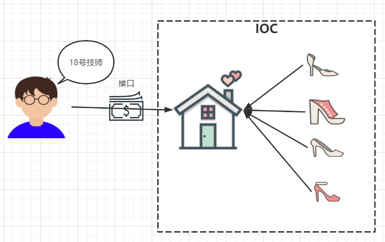
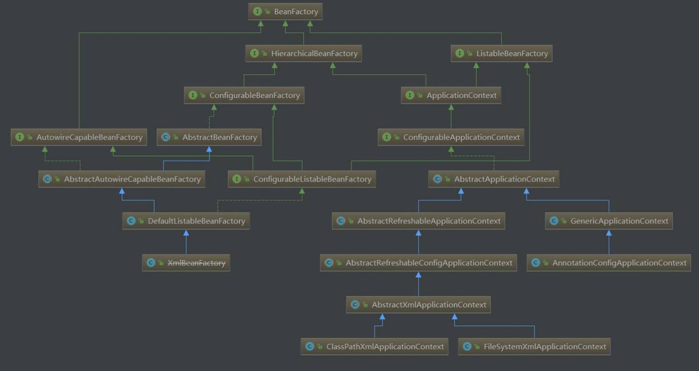
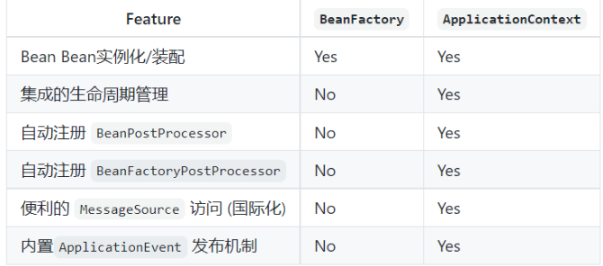
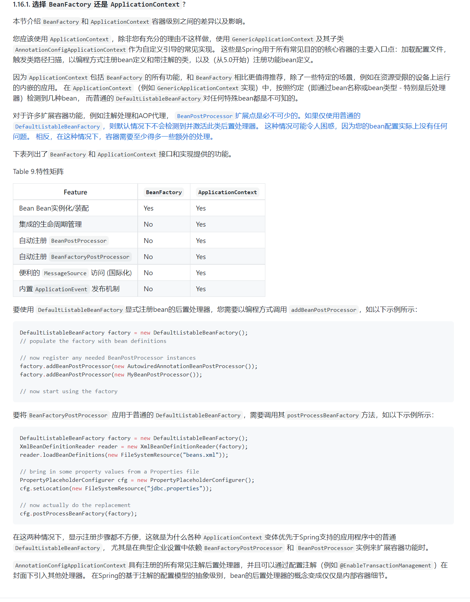
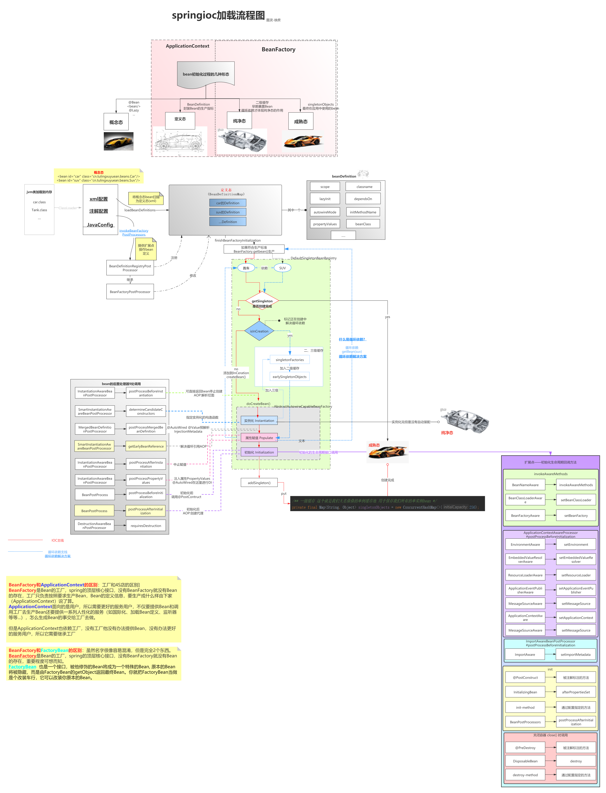
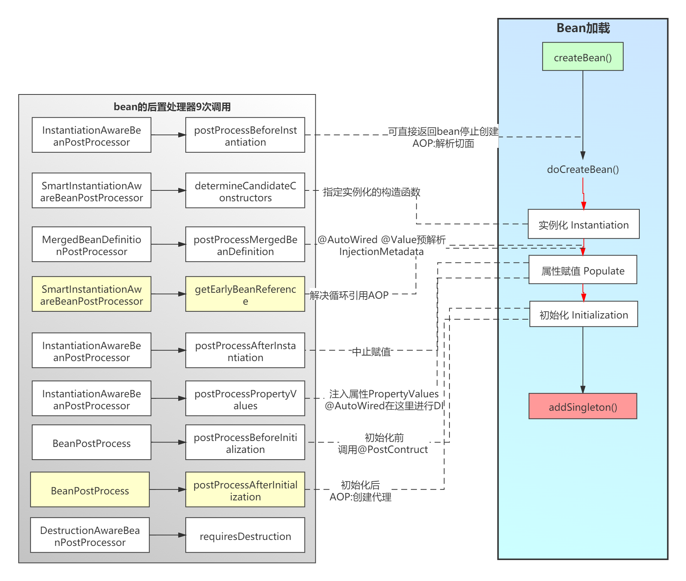

# 二、Spring IOC

[返回首页](../README.md)

## 3.什么是Spring IOC 容器？有什么作用？

控制反转即IoC (Inversion of Control)，它把传统上由程序代码直接操控的对象的调用权交给容器，通过容器来实现对象组件的装配和管理。所谓的“控制反转”概念就是对组件对象控制权的转移，从程序代码本身转移到了外部容器。

Spring IOC 负责创建对象，管理对象（通过依赖注入（DI），装配对象，配置对象，并且管理这些对象的整个生命周期。

对于 IoC 来说，最重要的就是容器。容器管理着 Bean 的生命周期，控制着 Bean 的依赖注入。

控制反转(IoC)有什么作用

- 管理对象的创建和依赖关系的维护。对象的创建并不是一件简单的事，在对象关系比较复杂时，如果依赖关系需要程序猿来维护的话，那是相当头疼的

- 解耦，由容器去维护具体的对象

- 托管了类的产生过程，比如我们需要在类的产生过程中做一些处理，最直接的例子就是代理，如果有容器程序可以把这部分处理交给容器，应用程序则无需去关心类是如何完成代理的

人话：

作用：

控制反转 控制了什么？

UserService service=new UserService(); // 耦合度太高 、维护不方便

引入Ioc 就将创建对象的控制权交给Spring的Ioc. 以前由程序员自己控制对象创建， 现在交给Spring的Ioc去创建， 如果要去使用对象需要通过DI（依赖注入）@Autowired 自动注入 就可以使用对象 ;

优点： 1.集中管理对象、方便维护 。2.降低耦合度

IOC的优点是什么？

- 最小的代价和最小的侵入性使松散耦合得以实现。

- IOC容器支持加载服务时的饿汉式初始化和懒加载。

## 4.Spring IoC 的实现机制是什么？

Spring 中的 IoC 的实现原理就是工厂模式加反射机制。

示例：

```
interfacefruit{
public abstract void eat(); } classAppleimplementsfruit{ public void eat(){ System.out.println("Apple");
} } classOrangeimplementsfruit{ public void eat(){ System.out.println("Orange");
} } classFactory{
public staticfruitgetInstance(String ClassName){ fruit f=null;
try{ f=(fruit)Class.forName(ClassName).newInstance();
}catch (Exception e) { e.printStackTrace();
}
returnf;
} } classhello{
public static void main(String[]a){ fruit f=Factory.getInstance("Reflect.Apple");
if(f!=null){ f.eat();
}
} }
```

## 5.什么是Spring的依赖注入(DI)？IOC和DI的区别是什么

很多人把IOC和DI说成一个东西，笼统来说的话是没有问题的，但是本质上还是有所区别的,希望大家能够严谨一点，IOC和DI是从不同的角度描述的同一件事，IOC是从容器的角度描述，而DI是从应用程序的角度来描述，也可以这样说，IOC是依赖倒置原则的设计思想，而DI是具体的实现方式

在面向对象设计的软件系统中，底层的实现都是由N个对象组成的，所有的对象通过彼此的合作，最终实现系统的业务逻辑。


有一个对象出了问题，就可能会影响到整个流程的正常运转。现在，伴随着工业级应用的规模越来越庞大，对象之间的依赖关系也越来越复杂，经常会出现对象之间的多重依赖性关系，因此，架构师和设计师对于系统的分析和设计，将面临更大的挑战。对象之间耦合度过高的系统，必然会出现牵一发而动全身的情形。



大家看到了吧，由于引进了中间位置的“第三方”，也就是IOC容器，对象和对象之间没有了耦合关系， 它起到了一种类似“粘合剂”的作用，把系统中的所有对象粘合在一起发挥作用，如果没有这个“粘合剂”，对象与对象之间会彼此失去联系，这就是有人把IOC容器比喻成“粘合剂”的由来。

## 6.紧耦合和松耦合有什么区别？

- 紧耦合：

- 紧密耦合是指类之间高度依赖。

- 松耦合：

- 松耦合是通过促进单一职责和关注点分离、依赖倒置的设计原则来实现的。

## 7.BeanFactory的作用

- BeanFactory是Spring中非常核心的一个顶层接口；

- 它是Bean的“工厂”、它的主要职责就是生产Bean；

- 它实现了简单工厂的设计模式，通过调用getBean传入标识生产一个Bean；

- 它有非常多的实现类、每个工厂都有不同的职责（单一职责）功能，最强大的工厂是：DefaultListableBeanFactory Spring底层就是使用的该实现工厂进行生产Bean的

- BeanFactory它也是容器 Spring容器（管理着Bean的生命周期）



## 8. BeanDefinition的作用

它主要负责存储Bean的定义信息:决定Bean的生产方式。

如：spring.xml

```
<beanclass="com.tuling.User"id="user"scope="singleton"lazy="false" abstract="false"autowire="none" ....> <property name="username"value="xushu"> </bean
```

后续BeanFactory根据这些信息就行生产Bean： 比如实例化 可以通过class进行反射进而得到实例对象 ， 比如lazy 则不会在ioc加载时创建Bean

## 9. BeanFactory 和 ApplicationContext有什么区别？

BeanFactory和ApplicationContext是Spring的两大核心接口，都可以当做Spring的容器。其中ApplicationContext是BeanFactory的子接口。

依赖关系

BeanFactory：是Spring里面最顶层的接口，包含了各种Bean的定义，读取bean配置文档，管理bean的加载、实例化，控制bean的生命周期，维护bean之间的依赖关系。BeanFactory 简单粗暴，可以理解为就是个 HashMap，Key 是 BeanName，Value 是 Bean 实例。通常只提供注册（put），获取（get）这两个功能。我们可以称之为 “低级容器”。

ApplicationContext 可以称之为 “高级容器”。因为他比 BeanFactory 多了更多的功能。他继承了多个接口。因此具备了更多的功能。例如资源的获取，支持多种消息（例如 JSP tag 的支持），对 BeanFactory 多了工具级别的支持等待。所以你看他的名字，已经不是 BeanFactory 之类的工厂了，而是 “应用上下文”， 代表着整个大容器的所有功能。该接口定义了一个 refresh 方法，此方法是所有阅读 Spring 源码的人的最熟悉的方法，用于刷新整个容器，即重新加载/刷新所有的 bean。

ApplicationContext接口作为BeanFactory的派生，除了提供BeanFactory所具有的功能外，还提供了更完整的框架功能：



官方：



10.BeanFactory 和FactoryBean有什么区别？

BeanFactory是一个工厂，也就是一个容器，是来管理和生产bean的；

FactoryBean是一个bean，但是它是一个特殊的bean，所以也是由BeanFactory来管理的，

它是一个接口，他必须被一个bean去实现。

不过FactoryBean不是一个普通的Bean，它会表现出工厂模式的样子,是一个能产生或者修饰对象生成的工厂Bean，

里面的getObject()就是用来获取FactoryBean产生的对象。所以在BeanFactory中使用“&”来得到FactoryBean本身，

用来区分通过容器获取FactoryBean产生的对象还是获取FactoryBean本身。

## 11. IOC容器的加载过程：

从概念态--->定义态的过程

1、实例化一个ApplicationContext的对象；

2：调用bean工厂后置处理器完成扫描；

3：循环解析扫描出来的类信息；

4、实例化一个BeanDefinition对象来存储解析出来的信息；

5、把实例化好的beanDefinition对象put到beanDefinitionMap当中缓存起来，

以便后面实例化bean；

6、再次调用其他bean工厂后置处理器；

从定义态到纯净态

7：当然spring还会干很多事情，比如国际化，比如注册BeanPostProcessor等

等，如果我们只关心如何实例化一个bean的话那么这一步就是spring调用

finishBeanFactoryInitialization方法来实例化单例的bean，实例化之前spring要做验证，

需要遍历所有扫描出来的类，依次判断这个bean是否Lazy，是否prototype，是否

abstract等等；

8：如果验证完成spring在实例化一个bean之前需要推断构造方法，因为spring实

例化对象是通过构造方法反射，故而需要知道用哪个构造方法；

9：推断完构造方法之后spring调用构造方法反射实例化一个对象；注意我这里说

的是对象、对象、对象；这个时候对象已经实例化出来了，但是并不是一个完整的bean，

最简单的体现是这个时候实例化出来的对象属性是没有注入，所以不是一个完整的bean；

从纯净态到成熟态

10：spring处理合并后的beanDefinition

11：判断是否需要完成属性注入

12：如果需要完成属性注入，则开始注入属性

初始化

13、判断bean的类型回调Aware接口

14、调用生命周期回调方法

15、如果需要代理则完成代理

创建完成

16、put到单例池——bean完成——存在spring容器当中



## 12.你知道Spring的哪些扩展点，在什么时候调用？

Spring中非常非常多的扩展接口，当然你也不需要全部回答，可以挑重点回答：

- 执行BeanFactoryPostProcessor的postProcessBeanFactory方法

```
/*** *作用： 在注册BeanDefinition的可以对beanFactory进行扩展 后 *调用时机： Ioc加载时注册BeanDefinition 的时候会调用 */public classMyBeanFactoryPostProcessorimplementsBeanFactoryPostProcessor{ @Override public void postProcessBeanFactory(ConfigurableListableBeanFactory beanFactory) throwsBeansException{ }}
```

- 执行BeanDefinitionRegistryPostProcessor的postProcessBeanDefinitionRegistry方法：

```
/*** *作用：动态注册BeanDefinition *调用时机： Ioc加载时注册BeanDefinition 的时候会调用 */@Componentpublic classMyBeanDefinitionRegistryPostProcessorimplementsBeanDefinitionRegistryPostProcessor{ @Override public void postProcessBeanDefinitionRegistry(BeanDefinitionRegistry registry) throwsBeansException{RootBeanDefinition beanDefinition= newRootBeanDefinition(Car.class);registry.registerBeanDefinition("car",beanDefinition); }
```

- 加载BeanPostProcessor实现类 : 在Bean的生命周期会调用9次Bean的后置处理器

- 创建所有单例bean



初始化阶段:

- 初始化阶段调用XXXAware接口的SetXXXAware方法 ：

生命周期回调： 初始化、销毁

- 执行BeanPostProcessor实现类的postProcessBeforeInitialization方法

- 执行InitializingBean实现类的afterPropertiesSet方法

- 执行bean的init-method属性指定的初始化方法

- 执行BeanPostProcessor实现类的postProcessAfterInitialization方法

- 初始化完成

- 关闭容器，执行DiposibleBean实现类的destory

- 执行bean的destroy-method属性指定的初始化方法

[上一章](01-spring-framework.md) · [返回首页](../README.md) · [下一章](03-spring-beans.md)
