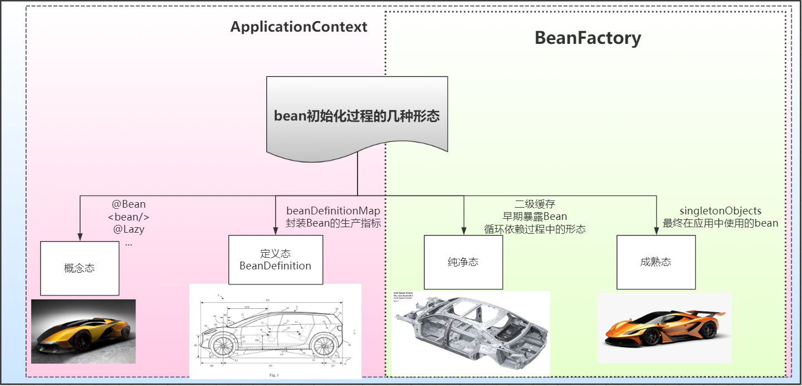
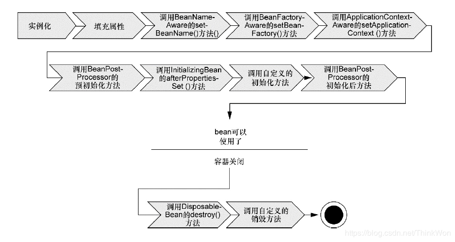
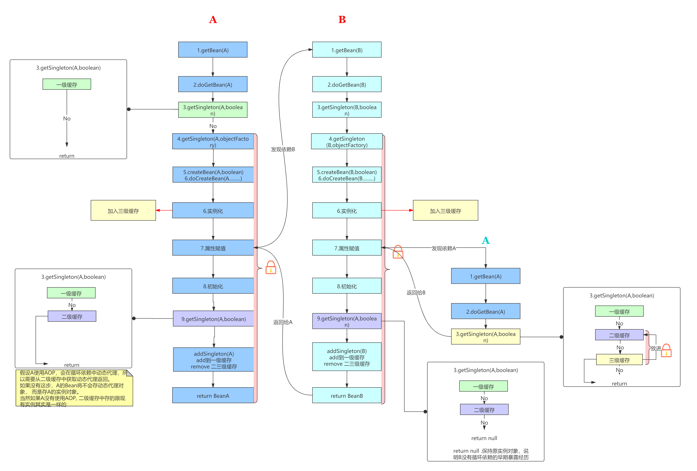
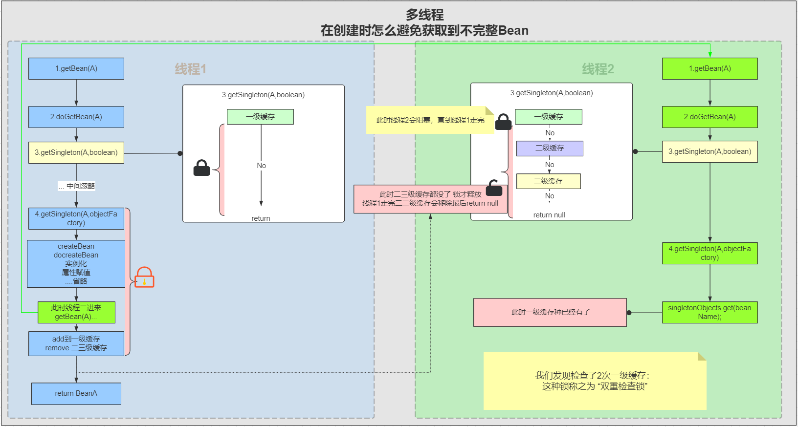
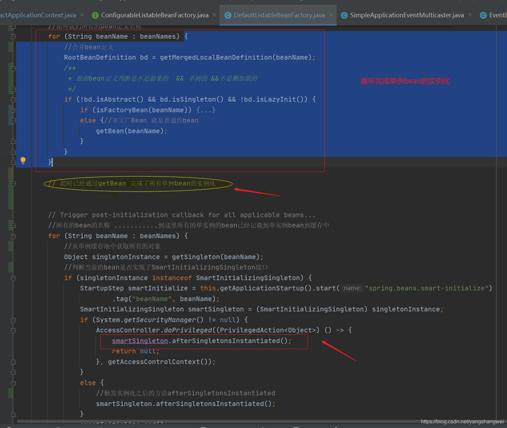
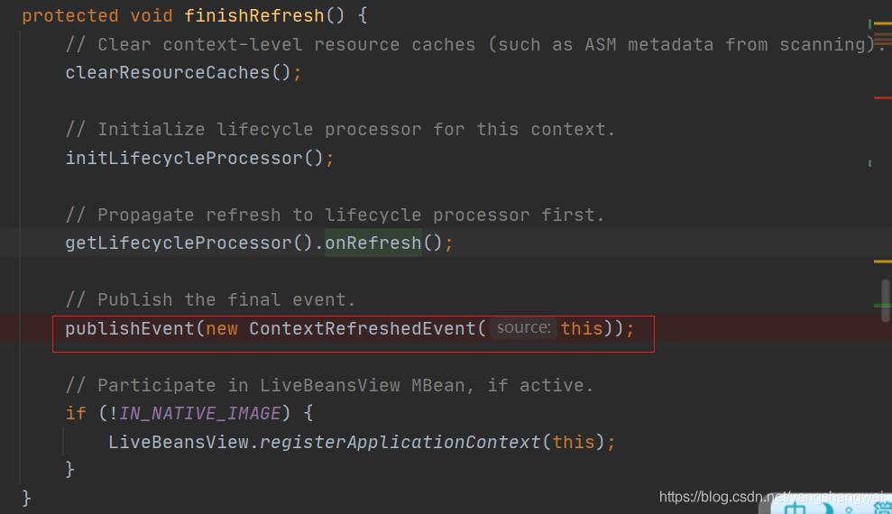
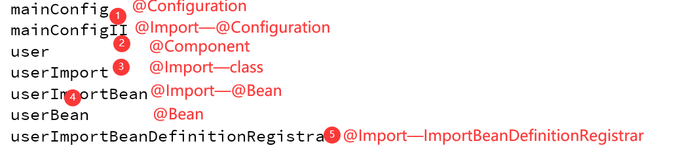

# 三、Spring Beans

[返回首页](../README.md)

## 13.什么是Spring beans？

Spring 官方文档对 bean 的解释是：

In Spring, the objects that form the backbone of your application and that are managed by the Spring IoC container are called beans. A bean is an object that is instantiated, assembled, and otherwise managed by a Spring IoC container.

翻译过来就是：

在 Spring 中，构成应用程序主干并由Spring IoC容器管理的对象称为bean。bean是一个由Spring IoC容器实例化、组装和管理的对象。

概念简单明了，我们提取处关键的信息：

- bean是对象，一个或者多个不限定

- bean由Spring中一个叫IoC的东西管理

## 14.配置Bean有哪几种方式？

1.xml: <bean class="com.tuling.UserService" id="">

2.注解：@Component(@Controller 、@Service、@Repostory) 前提：需要配置扫描包<component-scan> 反射调用构造方法

3.javaConfig: @Bean 可以自己控制实例化过程

4.@Import 3种方式

## 15.解释Spring支持的几种bean的作用域

Spring框架支持以下五种bean的作用域：

- singleton : bean在每个Spring ioc 容器中只有一个实例。

- prototype：一个bean的定义可以有多个实例。

- request：每次http请求都会创建一个bean，该作用域仅在基于web的Spring ApplicationContext情形下有效。

- session：在一个HTTP Session中，一个bean定义对应一个实例。该作用域仅在基于web的Spring ApplicationContext情形下有效。

- application：全局 Web 应用程序范围的范围标识符。

注意： 缺省的Spring bean 的作用域是Singleton。使用 prototype 作用域需要慎重的思考，因为频繁创建和销毁 bean 会带来很大的性能开销。

## 16、单例bean的优势

由于不会每次都新创建新对象所以有一下几个性能上的优势：

1.减少了新生成实例的消耗新生成实例消耗包括两方面，第一，spring会通过反射或者cglib来生成bean实例这都是耗性能的操作，其次给对象分配内存也会涉及复杂算法。 提供服务器内存的利用率 ，减少服务器内存消耗

2.减少jvm垃圾回收由于不会给每个请求都新生成bean实例，所以自然回收的对象少了。

3.可以快速获取到bean因为单例的获取bean操作除了第一次生成之外其余的都是从缓存里获取的所以很快。

## 17.Spring实例化bean方式的几种方式

- 构造器方式（反射）；

- 静态工厂方式； factory-method

- 实例工厂方式(@Bean)； factory-bean+factory-method

- FactoryBean方式

## 18.Spring框架中的单例bean是线程安全的吗？（阿里一面）

不是，Spring框架中的单例bean不是线程安全的。

spring 中的 bean 默认是单例模式，spring 框架并没有对单例 bean 进行多线程的封装处理。

实际上大部分时候 spring bean 无状态的（比如 dao 类），所以某种程度上来说 bean 也是安全的，但如果 bean 有状态的话（比如 view model 对象），那就要开发者自己去保证线程安全了，最简单的就是改变 bean 的作用域，把“singleton”变更为“prototype”，这样请求 bean 相当于 new Bean()了，所以就可以保证线程安全了。

- 有状态就是有数据存储功能（比如成员变量读写）。

- 无状态就是不会保存数据。

## 19.Spring如何处理线程并发问题？

在一般情况下，只有无状态的Bean才可以在多线程环境下共享，在Spring中，绝大部分Bean都可以声明为singleton作用域，因为Spring对一些Bean中非线程安全状态采用ThreadLocal进行处理，解决线程安全问题。

ThreadLocal和线程同步机制都是为了解决多线程中相同变量的访问冲突问题。同步机制采用了“时间换空间”的方式，仅提供一份变量，不同的线程在访问前需要获取锁，没获得锁的线程则需要排队。而ThreadLocal采用了“空间换时间”的方式。

ThreadLocal会为每一个线程提供一个独立的变量副本，从而隔离了多个线程对数据的访问冲突。因为每一个线程都拥有自己的变量副本，从而也就没有必要对该变量进行同步了。ThreadLocal提供了线程安全的共享对象，在编写多线程代码时，可以把不安全的变量封装进ThreadLocal。

```
/*** * @Author徐庶 QQ:1092002729 * @Slogan致敬大师，致敬未来的你 * *单例Bean的情况 *如果在类中声明成员变量 并且有读写操作（有状态），就是线程不安全 *解决： * 1.设置为多例 * 2.将成员变量放在ThreadLocal * 3.同步锁 会影响服务器吞吐量 *但是! *只需要把成员变量声明在方法中（无状态）， 单例Bean是线程安全的 */public classRun{ public static void main(String[]args) {AnnotationConfigApplicationContext applicationContext= newAnnotationConfigApplicationContext(MainConfig.class); // 线程一UserService bean=applicationContext.getBean(UserService.class); newThread(() -> {System.out.println(bean.welcome("张三")); }).start(); // 线程二UserService bean2=applicationContext.getBean(UserService.class); newThread(() -> {System.out.println(bean2.welcome("李四")); }).start(); }
```

## 20.什么是bean装配？

装配，或bean 装配是指在Spring 容器中把bean组装到一起，前提是容器需要知道bean的依赖关系，如何通过依赖注入来把它们装配到一起。

## 21.什么是bean的自动装配？

在Spring框架中，在配置文件中设定bean的依赖关系是一个很好的机制，Spring 容器能够自动装配相互合作的bean，这意味着容器不需要和配置，能通过Bean工厂自动处理bean之间的协作。这意味着 Spring可以通过向Bean Factory中注入的方式自动搞定bean之间的依赖关系。自动装配可以设置在每个bean上，也可以设定在特定的bean上。

## 22. 自动装配有哪些限制(需要注意）？

- 一定要声明set方法

- 覆盖： 你仍可以用 < constructor-arg >和 < property > 配置来定义依赖，这些配置将始终覆盖自动注入。

- 基本数据类型：不能自动装配简单的属性，如基本数据类型、字符串和类。 (手动注入还是可以注入基本数据类型的 <property value="" @Value)

- 模糊特性：自动装配不如显式装配精确，如果有可能尽量使用显示装配。

所以更推荐使用手动装配(@Autowired（根据类型、再根据名字） ref="" 这种方式 更加灵活更加清晰 )

## 23.解释不同方式的自动装配，spring 自动装配 bean 有哪些方式？

在spring中，对象无需自己查找或创建与其关联的其他对象，由容器负责把需要相互协作的对象引用赋予各个对象，使用autowire来配置自动装载模式。

在Spring框架xml配置中共有5种自动装配：

- no：默认的方式是不进行自动装配的，通过手工设置ref属性来进行装配bean。@Autowired 来进行手动指定需要自动注入的属性

- byName：通过bean的名称进行自动装配，如果一个bean的 property 与另一bean 的name 相同，就进行自动装配。

- byType：通过参数的数据类型进行自动装配。

- constructor：利用构造函数进行装配，并且构造函数的参数通过byType进行装配。

- autodetect：自动探测，如果有构造方法，通过 construct的方式自动装配，否则使用 byType的方式自动装配。 （在spring3.0+弃用）

24.有哪些生命周期回调方法？有哪几种实现方式？

有两个重要的bean 生命周期方法，第一个是init ， 它是在容器加载bean的时候被调用。第二个方法是 destroy 它是在容器卸载类的时候被调用。

bean 标签有两个重要的属性（init-method和destroy-method）。用它们你可以自己定制初始化和注销方法。它们也有相应的注解（@PostConstruct和@PreDestroy）。

## 20.Spring 在加载过程中Bean有哪几种形态：



## 25. 解释Spring框架中bean的生命周期

Bean生命周期：指定的就是Bean从创建到销毁的整个过程: 分4大不：

- 实例化

- 通过反射去推断构造函数进行实例化

- 实例工厂、 静态工厂

- 属性赋值

- 解析自动装配（byname bytype constractor none @Autowired） DI的体现

- 循环依赖

- 初始化

- 调用XXXAware回调方法

- 调用初始化生命周期回调（三种）

- 如果bean实现aop 创建动态代理

- 销毁

- 在spring容器关闭的时候进行调用

- 调用销毁生命周期回调

下图展示了bean装载到Spring应用上下文中的一个典型的生命周期过程。



bean在Spring容器中从创建到销毁经历了若干阶段，每一阶段都可以针对Spring如何管理bean进行个性化定制。

正如你所见，在bean准备就绪之前，bean工厂执行了若干启动步骤。

我们对上图进行详细描述：

Spring对bean进行实例化；

Spring将值和bean的引用注入到bean对应的属性中；

如果bean实现了BeanNameAware接口，Spring将bean的ID传递给setBean-Name()方法；

如果bean实现了BeanFactoryAware接口，Spring将调用setBeanFactory()方法，将BeanFactory容器实例传入；

如果bean实现了ApplicationContextAware接口，Spring将调用setApplicationContext()方法，将bean所在的应用上下文的引用传入进来；

如果bean实现了BeanPostProcessor接口，Spring将调用它们的post-ProcessBeforeInitialization()方法；

如果bean实现了InitializingBean接口，Spring将调用它们的after-PropertiesSet()方法。类似地，如果bean使用initmethod声明了初始化方法，该方法也会被调用；

如果bean实现了BeanPostProcessor接口，Spring将调用它们的post-ProcessAfterInitialization()方法；

此时，bean已经准备就绪，可以被应用程序使用了，它们将一直驻留在应用上下文中，直到该应用上下文被销毁；

如果bean实现了DisposableBean接口，Spring将调用它的destroy()接口方法。同样，如果bean使用destroy-method声明了销毁方法，该方法也会被调用。

现在你已经了解了如何创建和加载一个Spring容器。但是一个空的容器并没有太大的价值，在你把东西放进去之前，它里面什么都没有。为了从Spring的DI(依赖注入)中受益，我们必须将应用对象装配进Spring容器中。

## 26、Spring是如何解决Bean的循环依赖？

Spring是如何解决的循环依赖： 采用三级缓存解决的 就是三个Map ； 关键： 一定要有一个缓存保存它的早期对象作为死循环的出口

- 一级缓存：存储完整的Bean

- 二级缓存： 避免多重循环依赖的情况 重复创建动态代理。

- 三级缓存：

- 缓存是函数接口：通过lambda 把方法传进去（ 把Bean的实例和Bean名字传进去（aop创建） ）

- 不会立即调：（如果在实例化后立即调用的话：所有的aop 不管bean是否循环依赖都会在 实例化后创建proxy, 正常Bean 其实spring还是希望遵循生命周期在初始化创建动态代理， 只能循环依赖才创建)

- 会在 ABA (第二次getBean(A) 才会去调用三级缓存（如果实现了aop才会创建动态代理，如果没有实现依然返回的Bean的实例））

- 放入二级缓存（避免重复创建）



夺命连环问：

- 二级缓存能不能解决循环依赖？

- 如果只是死循环的问题： 一级缓存就可以解决 ：无法避免在并发下获取不完整的Bean?

- 二级缓存也可以解决循环依赖： 只不过如果出现重复循环依赖 会多次创建aop的动态代理

- Spring有没有解决多例Bean的循环依赖？

- 多例不会使用缓存进行存储（多例Bean每次使用都需要重新创建）

- 不缓存早期对象就无法解决循环

- Spring有没有解决构造函数参数Bean的循环依赖？

- 构造函数的循环依赖也是会报错

- 可以通过人工进行解决：@Lazy

- 就不会立即创建依赖的bean了

- 而是等到用到才通过动态代理进行创建

## 27.Spring如何避免在并发下获取不完整的Bean?

双重检查锁

- 为什么一级缓存不加到锁里面：

- 性能：避免已经创建好的Bean阻塞等待



## 28.BeanDefinition的加载过程：

BeanDefinition的加载过程就是将 概念态的Bean注册为定义态的Bean

不同的Spring上下文会有不同的注册过程，但是会用共同的api步骤：

- 通过BeanDefinitionReader 将配置类(AnnotatedBeanDefinitionReader)（xml文件:XmlBeanDefinitionReader) 注册为BeanDefinition

- 解析配置类ConfigurationClassParser(xml文件:BeanDefinitionDocumentReader）

- 不同的注解（xml节点）有不同的解析器

- 比如ComponentScan 需要通过ClassPathBeanDefinitionScanner扫描所有类找到类上面有@Import的类

- 将读取到的Bean定义信息通过BeanDefinitionRegistry注册为一个BeanDefinition

## 29. 如何在Spring所有BeanDefinition注册完后做扩展？

通常可以使用beanFactoryPostProcessor 对已注册的BeanDefinition进行修改、

或者通过它的子接口BeanDefinitionRegistryPostProcessor 再进行注册

## 30.如何在Spring所有Bean创建完后做扩展？

哪里才算所有的Bean创建完： new ApplicationContext()---->refresh()---->finishBeanFactoryInitialization（循环所有的BeanDefinition ,通过BeanFactory.getBean()生成所有的Bean） 这个循环结束之后所有的bean也就创建完了

## 31、Spring容器启动时，为什么先加载BeanFactoryPostProcess

1.因为BeanDefinition会在ioc容器加载的先注册， 而BeanFactoryPostProcess就是在所有的BeanDefinition注册完后做扩展的，所以要先加载BeanFactoryPostProcess

2. 解析配置类的组件 它就实现BeanFactoryPostProcess， 所以要先去加载BeanFactoryPostProcess

1.方式一 基于SmartInitializingSingleton接口

Source

在创建所有单例Bean的方法中：

```
finishBeanFactoryInitialization(beanFactory);
```

SmartInitializingSingleton接口是在所有的Bean实例化完成以后，Spring回调的方法, 所以这里也是一个扩展点，可以在单例bean全部完成实例化以后做处理。



Code

【配置类】

```
packagecom.artisan.beanLoadedExtend.smartinit;importorg.springframework.context.annotation.ComponentScan;importorg.springframework.context.annotation.Configuration;@Configuration@ComponentScan("com.artisan.beanLoadedExtend")public classSmartInitConfig{
```

【扩展类 implements SmartInitializingSingleton 】

```
packagecom.artisan.beanLoadedExtend.smartinit;importorg.springframework.beans.factory.SmartInitializingSingleton;importorg.springframework.stereotype.Component;@Componentpublic classSmartInitExtendimplementsSmartInitializingSingleton{ @Override public void afterSingletonsInstantiated() {System.out.println("all singleton beans loaded , 自定义扩展here "); }}
```

【测试】

```
packagecom.artisan.beanLoadedExtend.smartinit;importorg.springframework.context.annotation.AnnotationConfigApplicationContext;public classTest{ public static void main(String[]args) {AnnotationConfigApplicationContext ac= newAnnotationConfigApplicationContext(SmartInitConfig.class); }}
```

2.方式二 基于Spring事件监听

Source

生命周期的最后一步是finishRefresh();，这里面中有一个方法是publishEvent



所以这里也可以进行扩展，监听ContextRefreshedEvent事件 。

## 32. Bean的创建顺序是什么样的？

Bean的创建顺序是由BeanDefinition的注册顺序来决定的, 当然依赖关系也会影响Bean创建顺序 （A-B)。

BeanDefinition的注册顺序由什么来决定的？

主要是由注解（配置）的解析顺序来决定：


- @Configuration

- @Component

- @Import—类

- @Bean

- @Import—ImportBeanDefinitionRegistrar



6、BeanDefinitionRegistryPostProcessor

[上一章](02-spring-ioc.md) · [返回首页](../README.md) · [下一章](04-spring-annotations.md)
