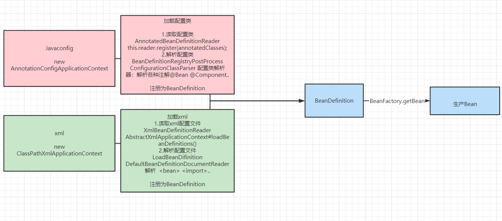
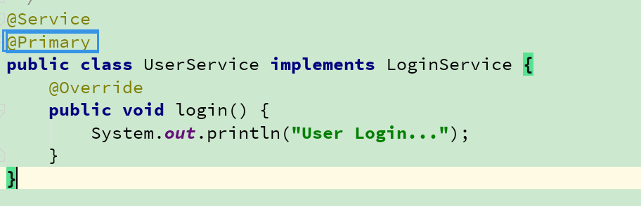
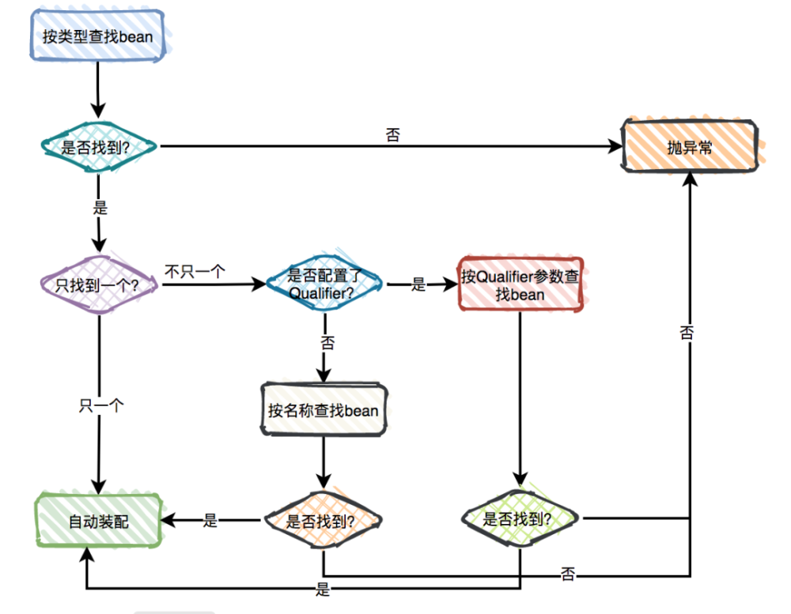

# 四、Spring注解

[返回首页](../README.md)

## 33.Spring有哪几种配置方式：

这里有三种重要的方法给Spring 容器提供配置元数据。

- XML配置文件。 spring诞生

- spring.xml <bean>

- 基于注解的配置。 Spring2.5+

- spring.xml <component-scan base-package=" "/> @Component @Autowired

- 基于java的配置。 JavaConfig Spring3.0+

- @Configuration @Bean ....

## 34.用过JavaConfig方式的spring配置吗？它是如何替代xml的？

基于Java的配置，允许你在少量的Java注解的帮助下，进行你的大部分Spring配置而非通过XML文件。

以@Configuration 注解为例，它用来标记类可以当做一个bean的定义，被Spring IOC容器使用。

另一个例子是@Bean注解，它表示此方法将要返回一个对象，作为一个bean注册进Spring应用上下文。

```
@Configurationpublic class StudentConfig{ @Bean publicStudentBeanmyStudent(){ returnnewStudentBean(); }}
```

应用：

- 以前Xml

- Spring容器 ClassPathXmlApplicationContext("xml")

- Spring.xml

- <bean scope lazy>

- 扫描包: <component-scan>

- 引入外部属性配置文件 <property-placeHodeler resource="xxx.properties">

- <property name="password" value="${mysql.password}"></property>

- 指定其他配置文件：<import resource=""

- javaconfig

- Spring容器：AnnotationConfigApplicationContext(javaconfig.class)

- 配置类 @Configuration

- @Bean @Scope @Lazy

- 扫描包: @ComponentScan

- 引入外部属性配置文件 @PropertySource("classpath:db.properties")

- @Value("${mysql.password}")

- @Import @Import({配置类}) 使用比较灵活

源码：



## 35.@Component, @Controller, @Repository, @Service 有何区别？

@Component：这将 java 类标记为 bean。它是任何 Spring 管理组件的通用构造型。spring 的组件扫描机制现在可以将其拾取并将其拉入应用程序环境中。

@Controller：这将一个类标记为 Spring Web MVC 控制器。标有它的 Bean 会自动导入到 IoC 容器中。

@Service：此注解是组件注解的特化。它不会对 @Component 注解提供任何其他行为。您可以在服务层类中使用 @Service 而不是 @Component，因为它以更好的方式指定了意图。

@Repository：这个注解是具有类似用途和功能的 @Component 注解的特化。它为 DAO 提供了额外的好处。它将 DAO 导入 IoC 容器，并使未经检查的异常有资格转换为 Spring DataAccessException。

## 36.@Import可以有几种用法？

4种：

- 直接指定类 （如果配置类会按配置类正常解析、 如果是个普通类就会解析成Bean)

- 通过ImportSelector 可以一次性注册多个，返回一个string[] 每一个值就是类的完整类路径

- 通过DeferredImportSelector可以一次性注册多个，返回一个string[] 每一个值就是类的完整类路径

- 区别：DeferredImportSelector 顺序靠后

- 通过ImportBeanDefinitionRegistrar 可以一次性注册多个，通过BeanDefinitionRegistry来动态注册BeanDefintion

## 37.如何让自动注入没有找到依赖Bean时不报错

这个注解表明bean的属性必须在配置的时候设置，通过一个bean定义的显式的属性值或通过自动装配，若@Required注解的bean属性未被设置，容器将抛出BeanInitializationException。示例：

```
@Autowired(required= false)privateRole role;
```

## 38.如何让自动注入找到多个依赖Bean时不报错



## 39.@Autowired 注解有什么作用

@Autowired默认是按照类型装配注入的，默认情况下它要求依赖对象必须存在（可以设置它required属性为false）。@Autowired 注解提供了更细粒度的控制，包括在何处以及如何完成自动装配。

## 40.@Autowired和@Resource之间的区别

@Autowired可用于：构造函数、成员变量、Setter方法

@Autowired和@Resource之间的区别

- @Autowired默认是按照类型装配注入的，默认情况下它要求依赖对象必须存在（可以设置它required属性为false）。

- @Resource默认是按照名称来装配注入的，只有当找不到与名称匹配的bean才会按照类型来装配注入。

## 41.使用@Autowired注解自动装配的过程是怎样的？

记住：@Autowired 通过Bean的后置处理器进行解析的

## 1. 在创建一个Spring上下文的时候再构造函数中进行注册AutowiredAnnotationBeanPostProcessor

## 2. 在Bean的创建过程中进行解析

- 在实例化后预解析（解析@Autowired标注的属性、方法 比如：把属性的类型、名称、属性所在的类..... 元数据缓存起）

- 在属性注入真正的解析（拿到上一步缓存的元数据 去ioc容器帮进行查找，并且返回注入）

- 首先根据预解析的元数据拿到 类型去容器中进行查找

- 如果查询结果刚好为一个，就将该bean装配给@Autowired指定的数据；

- 如果查询的结果不止一个，那么@Autowired会根据名称来查找；

- 如果上述查找的结果为空，那么会抛出异常。解决方法时，使用required=false。



## 42.配置类@Configuration的作用解析原理:

## 1.@Configuration用来代替xml配置方式spring.xml配置文件 <bean>

## 2. 没有@Configuration也是可以配置@Bean

## 3. @Configuration加与不加有什么区别

## 4. 加了@Configuration会为配置类创建cglib动态代理（保证配置类@Bean方法调用Bean的单例），@Bean方法的调用就会通过容器.getBean进行获取

原理：

## 1.创建Spring上下文的时候会注册一个解析配置的处理器ConfigurationClassPostProcessor（实现BeanFactoryPostProcessor和BeanDefinitionRegistryPostProcessor)

## 2.在调用invokeBeanFactoryPostProcessor，就会去调用ConfigurationClassPostProcessor.postProcessBeanDefinitionRegistry进行解析配置（解析配置类说白就是去解析各种注解(@Bean @Configuration@Import @Component ... 就是注册BeanDefinition)

## 3. ConfigurationClassPostProcessor.postProcessBeanFactory去创建cglib动态代理

## 43.@Bean之间的方法调用是怎么保证单例的？

（ @Configuration加与不加的区别是什么？）

## 1.如果希望@bean的方法返回是对象是单例 需要在类上面加上@Configuration,

## 2.Spring 会在invokeBeanFactoryPostProcessor 通过内置BeanFactoryPostProcessor中会CGLib生成动态代理代理

## 3.当@Bean方法进行互调时， 则会通过CGLIB进行增强，通过调用的方法名作为bean的名称去ioc容器中获取，进而保证了@Bean方法的单例

## 44.要将一个第三方的类配成为Bean有哪些方式？

- 1. @Bean

## 2. @Import

## 3.通过Spring的扩展接口：BeanDefinitionRegistryPostProcessor

## 45、为什么@ComponentScan 不设置basePackage也会扫描？

因为Spring在解析@ComponentScan的时候 拿到basePackage 如果没有设置会将你的类所在的包的地址作为扫描包的地址

[上一章](03-spring-beans.md) · [返回首页](../README.md) · [下一章](05-spring-aop.md)
