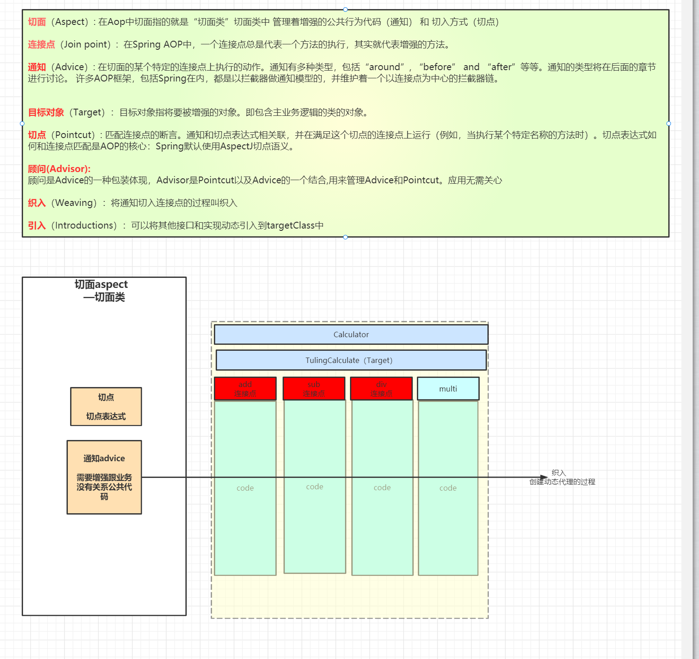
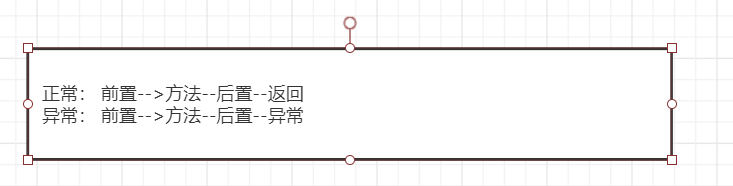
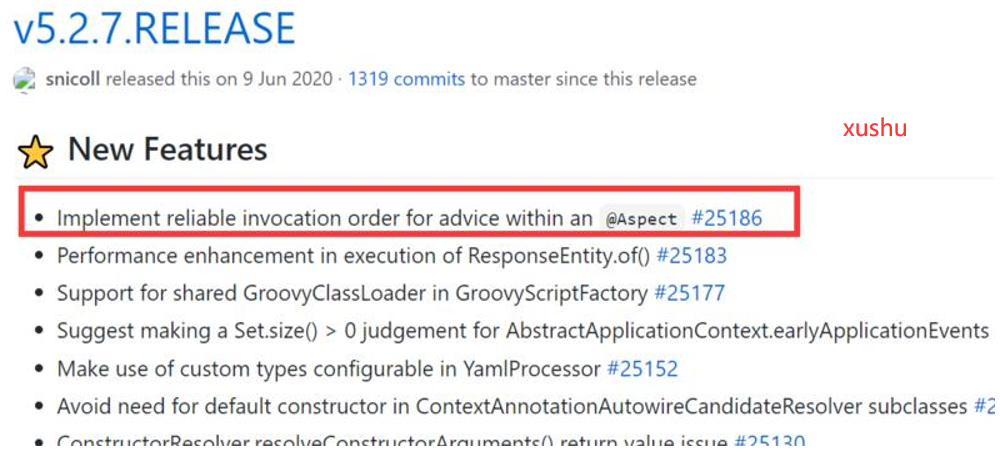
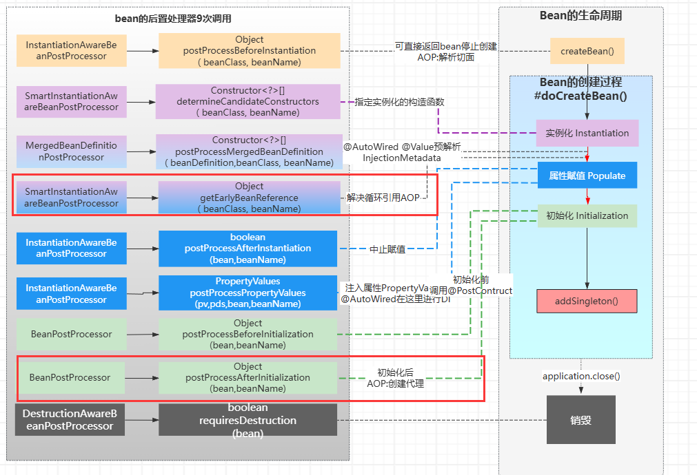
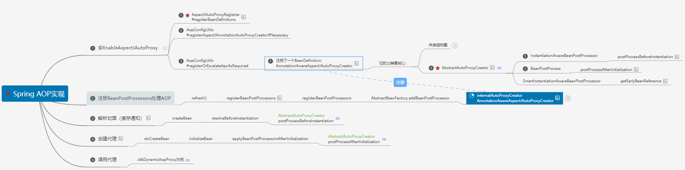

# 五、Spring AOP

[返回首页](../README.md)

## 46.什么是AOP、能做什么

AOP(Aspect-Oriented Programming)，一般称为面向切面编程，用于将那些与业务无关，但却对多个对象产生影响的公共行为和逻辑，抽取并封装为一个可重用的模块，这个模块被命名为“切面”（Aspect），减少系统中的重复代码，降低了模块间的耦合度，同时提高了系统的可维护性。

可用于权限认证、日志、事务处理等。

AOP、OOP在字面上虽然非常类似，但却是面向不同领域的两种设计思想。OOP（面向对象编程）针对业务处理过程的实体及其属性和行为进行抽象封装，以获得更加清晰高效的逻辑单元划分。 而AOP作为面向对象的一种补充，则是针对业务处理过程中的切面进行提取， 已达到业务代码和公共行为代码之间低耦合性的隔离效果。这两种设计思想在目标上有着本质的差异。

## 47.解释一下Spring AOP里面的几个名词

（1）切面（Aspect）： 在Spring Aop指定就是“切面类” ，切面类会管理着切点、通知。

（2）连接点（Join point）： 指定就是被增强的业务方法

（3）通知（Advice）： 就是需要增加到业务方法中的公共代码， 通知有很多种类型分别可以在需要增加的业务方法不同位置进行执行（前置通知、后置通知、异常通知、返回通知、环绕通知）

（4）切点（Pointcut）： 由他决定哪些方法需要增强、哪些不需要增强， 结合切点表达式进行实现

（5）目标对象（Target Object）： 指定是增强的对象

（6）织入（Weaving） ： spring aop用的织入方式：动态代理。 就是为目标对象创建动态代理的过程就叫织入。



## 48.Spring通知有哪些类型？

在AOP术语中，在的某个特定的连接点上执行的动作——官方

Spring切面可以应用5种类型的通知：

- 前置通知（Before）：在目标方法被调用之前调用通知功能；

- 后置通知（After）：在目标方法完成之后调用通知，此时不会关心方法的输出是什么；

- 返回通知（After-returning ）：在目标方法成功执行之后调用通知；

- 异常通知（After-throwing）：在目标方法抛出异常后调用通知；

- 环绕通知（Around）：通知包裹了被通知的方法，在被通知的方法调用之前和调用之后执行自定义的行为。

执行顺序：



Spring在5.2.7之后就改变的advice 的执行顺序。 在github官网版本更新说明中有说明：如图

1、正常执行：@Before---&gt;方法----&gt;@AfterReturning---&gt;@After

2、异常执行：@Before---&gt;方法----&gt;@AfterThrowing---&gt;@After



更新说明：

[https://github.com/spring-projects/spring-framewor...](https://github.com/spring-projects/spring-framework/releases/tag/v5.2.7.RELEASE)

#25186链接：

[https://github.com/spring-projects/spring-framewor...](https://github.com/spring-projects/spring-framework/issues/25186)

## 49.Spring AOP and AspectJ AOP 有什么区别？

关系：

- 当在Spring中要使用@Aspect、@Before.等这些注解的时候， 就需要添加AspectJ相关依赖

```
<dependency> <groupId>org.aspectj</groupId> <artifactId>aspectjweaver</artifactId> <version>1.9.5</version></dependency>
```

- Spring Aop提供了 AspectJ 的支持，但只用到的AspectJ的切点解析和匹配。 @Aspect、@Before.等这些注解都是由AspectJ 发明的

AOP实现的关键在于 代理模式，AOP代理主要分为静态代理和动态代理。静态代理的代表为AspectJ；动态代理则以Spring AOP为代表。

区别：

（2）Spring AOP使用的动态代理，它基于动态代理来实现。默认地，如果使用接口的，用 JDK 提供的动态代理实现，如果没有接口，使用 CGLIB 实现。

（1）AspectJ是静态代理的增强，所谓静态代理，就是AOP框架会在编译阶段生成AOP代理类，因此也称为编译时增强，他会在编译阶段将AspectJ(切面)织入到Java字节码中，运行的时候就是增强之后的AOP对象。

- 属于静态织入，它是通过修改代码来实现的，它的织入时机可以是：

- Compile-time weaving：编译期织入，如类 A 使用 AspectJ 添加了一个属性，类 B 引用了它，这个场景就需要编译期的时候就进行织入，否则没法编译类 B。

- Post-compile weaving：编译后织入，也就是已经生成了 .class 文件，或已经打成 jar 包了，这种情况我们需要增强处理的话，就要用到编译后织入。

- Load-time weaving：指的是在加载类的时候进行织入，要实现这个时期的织入，有几种常见的方法。1、自定义类加载器来干这个，这个应该是最容易想到的办法，在被织入类加载到 JVM 前去对它进行加载，这样就可以在加载的时候定义行为了。2、在 JVM 启动的时候指定 AspectJ 提供的 agent：-javaagent:xxx/xxx/aspectjweaver.jar。

- AspectJ 出身也是名门，来自于 Eclipse 基金会，link：

- [https://www.eclipse.org/aspectj](https://www.eclipse.org/aspectj)

- AspectJ 能干很多 Spring AOP 干不了的事情，它是 AOP 编程的完全解决方案。Spring AOP 致力于解决的是企业级开发中最普遍的 AOP 需求（方法织入），而不是力求成为一个像 AspectJ 一样的 AOP 编程完全解决方案。

- 因为 AspectJ 在实际代码运行前完成了织入，所以大家会说它生成的类是没有额外运行时开销的。

- 很多人会对比 Spring AOP 和 AspectJ 的性能，Spring AOP 是基于代理实现的，在容器启动的时候需要生成代理实例，在方法调用上也会增加栈的深度，使得 Spring AOP 的性能不如 AspectJ 那么好。

## 50.JDK动态代理和CGLIB动态代理的区别

Spring AOP中的动态代理主要有两种方式，JDK动态代理和CGLIB动态代理：

- JDK动态代理只提供接口的代理，不支持类的代理。

- JDK会在运行时为目标类生成一个 动态代理类$proxy*.class .

- 该代理类是实现了接目标类接口， 并且代理类会实现接口所有的方法增强代码。

- 调用时 通过代理类先去调用处理类进行增强，再通过反射的方式进行调用目标方法。从而实现AOP

- 如果代理类没有实现 接口，那么Spring AOP会选择使用CGLIB来动态代理目标类。

- CGLIB的底层是通过ASM在运行时动态的生成目标类的一个子类。（还有其他相关类，主要是为增强调用时效率） 会生成多个 ，

- 并且会重写父类所有的方法增强代码，

- 调用时先通过代理类进行增强，再直接调用父类对应的方法进行调用目标方法。从而实现AOP。

- CGLIB是通过继承的方式做的动态代理，因此如果某个类被标记为final，那么它是无法使用CGLIB做动态代理的。

- CGLIB 除了生成目标子类代理类，还有一个FastClass(路由类)，可以（但不是必须）让本类方法调用进行增强，而不会像jdk代理那样本类方法调用增强会失效

- 很多人会对比 JDK和Cglib的性能，jdk动态代理生成类速度快，调用慢，cglib生成类速度慢，但后续调用快，在老版本CGLIB的速度是JDK速度的10倍左右, 但是实际上JDK的速度在版本升级的时候每次都提高很多性能,而CGLIB仍止步不前.

在对JDK动态代理与CGlib动态代理的代码实验中看，1W次执行下，JDK7及8的动态代理性能比CGlib要好20%左右。

## 51.JavaConfig方式如何启用AOP?如何强制使用cglib?

```
@EnableAspectJAutoProxy//(proxyTargetClass = true) //强制CGLIB//(exposeProxy = true) 在线程中暴露代理对象@EnableAspectJAutoProxy
```

## 52.介绍AOP有几种实现方式

- Spring 1.2 基于接口的配置：最早的 Spring AOP 是完全基于几个接口的，想看源码的同学可以从这里起步。

- Spring 2.0 schema-based 配置：Spring 2.0 以后使用 XML 的方式来配置，使用 命名空间 &lt;aop &gt;&lt;/aop&gt;

- Spring 2.0

- [@AspectJ](https://github.com/AspectJ)

- 配置：使用注解的方式来配置，这种方式感觉是最方便的，还有，这里虽然叫做

- [@AspectJ](https://github.com/AspectJ)

- ，但是这个和 AspectJ 其实没啥关系。

- AspectJ 方式，这种方式其实和Spring没有关系，采用AspectJ 进行动态织入的方式实现AOP，需要用AspectJ 单独编译。

## 53.什么情况下AOP会失效,怎么解决？

失效原因：

- 方法是private 也会失效，解决：改成public

- 目标类没有配置为Bean也会失效， 解决：配置为Bean

- 切点表达式没有配置正确

- ...

内部调用不会触发AoP.

解决方式：必须走代理， 重新拿到代理对象再次执行方法才能进行增强

- 在本类中自动注入当前的bean

- 设置暴露当前代理对象到本地线程， 可以通过AopContext.currentProxy() 拿到当前正在调用的动态代理对象

```
@EnableAspectJAutoProxy(exposeProxy= true)
```

## 54.Spring的AOP是在哪里创建的动态代理？

- 正常的Bean会在Bean的生命周期的‘初始化’后， 通过BeanPostProcessor.postProcessAfterInitialization创建aop的动态代理

- 还有一种特殊情况： 循环依赖的Bean会在Bean的生命周期‘属性注入’时存在的循环依赖的情况下， 也会为循环依赖的Bean通过SmartInstantiationAwareBeanPostProcessor.getEarlyBeanReference创建aop



## 55.Spring的 Aop的完整实现流程？

Aop的实现大致分为三大步：JavaConfig

当@EnableAspectJAutoProxy 会通过@Import注册一个BeanPostProcessor处理AOP

1.解析切面： 在Bean创建之前的第一个Bean后置处理器会去解析切面（解析切面中通知、切点，一个通知就会解析成一个advisor(通知、切点)）

2.创建动态代理 正常的Bean初始化后调用BeanPostProcessor 拿到之前缓存的advisor ，再通过advisor中pointcut 判断当前Bean是否被切点表达式匹配，如果匹配，就会为Bean创建动态代理（创建方式1.jdk动态代理2.cglib)。

3.调用：拿到动态代理对象， 调用方法 就会判断当前方法是否增强的方法， 就会通过调用链的方式依次去执行通知.



[上一章](04-spring-annotations.md) · [返回首页](../README.md) · [下一章](06-spring-transactions.md)
