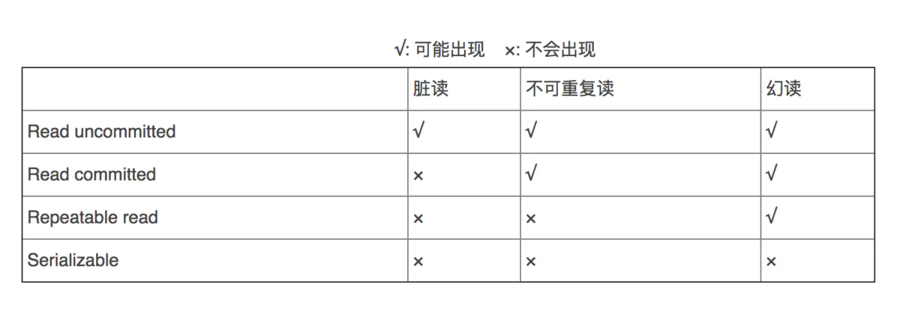
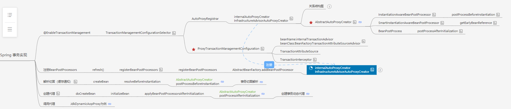

# 六、Spring事务

[返回首页](../README.md)

## 56.事务四大特性

⑴ 原子性（Atomicity）

原子性是指事务包含的所有操作要么全部成功，要么全部失败回滚， 因此事务的操作如果成功就必须要完全应用到数据库，如果操作失败则不能对数据库有任何影响。

⑵ 一致性（Consistency）

一致性是指事务必须使数据库从一个一致性状态变换到另一个一致性状态，也就是说一个事务执行之前和执行之后都必须处于一致性状态。

拿转账来说，假设用户A和用户B两者的钱加起来一共是5000，那么不管A和B之间如何转账，转几次账，事务结束后两个用户的钱相加起来应该还得是5000，这就是事务的一致性。

⑶ 隔离性（Isolation）

隔离性是当多个用户并发访问数据库时，比如操作同一张表时，数据库为每一个用户开启的事务，不能被其他事务的操作所干扰，多个并发事务之间要相互隔离。

即要达到这么一种效果：对于任意两个并发的事务T1和T2，在事务T1看来，T2要么在T1开始之前就已经结束，要么在T1结束之后才开始，这样每个事务都感觉不到有其他事务在并发地执行。

关于事务的隔离性数据库提供了多种隔离级别，稍后会介绍到。

⑷ 持久性（Durability）

持久性是指一个事务一旦被提交了，那么对数据库中的数据的改变就是永久性的，即便是在数据库系统遇到故障的情况下也不会丢失提交事务的操作。

例如我们在使用JDBC操作数据库时，在提交事务方法后，提示用户事务操作完成，当我们程序执行完成直到看到提示后，就可以认定事务以及正确提交，即使这时候数据库出现了问题，也必须要将我们的事务完全执行完成，否则就会造成我们看到提示事务处理完毕，但是数据库因为故障而没有执行事务的重大错误。

## 57.Spring支持的事务管理类型， spring 事务实现方式有哪些？

Spring支持两种类型的事务管理：

编程式事务管理：这意味你通过编程的方式管理事务，给你带来极大的灵活性，但是难维护。

声明式事务管理：这意味着你可以将业务代码和事务管理分离，你只需用注解和XML配置来管理事务。

实现声明式事务的三种方式：

- 基于接口

- 基于 TransactionInterceptor 的声明式事务: Spring 声明式事务的基础，通常也不建议使用这种方式，但是与aop一样，了解这种方式对理解 Spring 声明式事务有很大作用。

- 基于 TransactionProxyFactoryBean 的声明式事务: 第一种方式的改进版本，简化的配置文件的书写，这是 Spring 早期推荐的声明式事务管理方式，但是在 Spring 2.0 中已经不推荐了。

- 基于&lt; tx&gt; 和&lt; aop&gt;命名空间的声明式事务管理： 目前推荐的方式，其最大特点是与 Spring AOP 结合紧密，可以充分利用切点表达式的强大支持，使得管理事务更加灵活。

- 基于 @Transactional 的全注解方式： 将声明式事务管理简化到了极致。开发人员只需在配置文件中加上一行启用相关后处理 Bean 的配置，然后在需要实施事务管理的方法或者类上使用 @Transactional 指定事务规则即可实现事务管理，而且功能也不必其他方式逊色。

58、说一下Spring的事务传播行为

事务的传播特性指的是当一个事务方法被另一个事务方法调用时，这个事务方法应该如何进行？

```
@Transactionalpublic void trans(){ sub(); log(); // 记录流水 数据库操作 query();} @Transactional(SUPPORTS)publicinfoquery(){ ....}@Transactional REQUIRES_NEWpublic void log(){ // todo: 记录日志}
```

| 事务传播行为类型 | 外部不存在事务 | 外部存在事务 | 使用方式 |
| --- | --- | --- | --- |
| REQUIRED（默认） | 开启新的事务 | 融合到外部事务中 | @Transactional(propagation = Propagation.REQUIRED)<br>适用增删改查 |
| SUPPORTS | 不开启新的事务 | 融合到外部事务中 | @Transactional(propagation = Propagation.SUPPORTS)<br>适用查询 |
| REQUIRES_NEW | 开启新的事务 | 不用外部事务，创建新的事务 | @Transactional(propagation = Propagation.REQUIRES_NEW)<br>适用内部事务和外部事务不存在业务关联情况，如日志 |
| NOT_SUPPORTED | 不开启新的事务 | 不用外部事务 | @Transactional(propagation = Propagation.NOT_SUPPORTED)<br>不常用 |
| NEVER | 不开启新的事务 | 抛出异常 | @Transactional(propagation = Propagation.NEVER )<br>不常用 |
| MANDATORY | 抛出异常 | 融合到外部事务中 | @Transactional(propagation = Propagation.MANDATORY)<br>不常用 |
| NESTED | 开启新的事务 | 融合到外部事务中,SavePoint机制，外层影响内层， 内层不会影响外层 | @Transactional(propagation = Propagation.NESTED)<br>不常用 |

## 59.说一下 spring 的事务隔离？

用来解决并发事务所产生一些问题：

并发会产生什么问题？

1.脏读

2.不可重复度

3.幻影读

概念： 通过设置隔离级别可解决在并发过程中产生的那些问题：

1.脏读

| 事务1 begin | 事务2 begin |
| --- | --- |
|  | update t_user<br>set balance=800<br>where id=1;<br>#balance=800 |
| select * from t_user where id=1<br>commit;<br>#balance=800 |  |
|  | rollback; #回滚<br>#balance=1000 |

1. 一个事务，读取了另一个事务中没有提交的数据，会在本事务中产生的数据不一致的问题

解决方式：@Transactional(isolation = Isolation.READ_COMMITTED)

读已提交：READ COMMITTED

要求Transaction01只能读取Transaction02已提交的修改。

2.不可重复度

| 事务1 begin | 事务2 begin |
| --- | --- |
| select * from t_user where id=1<br>#balance=1000 |  |
|  | update t_user<br>set balance=800<br>where id=1;<br>commit;<br>#balance=800 |
| select * from t_user where id=1<br>#balance=800 |  |
| commit; |  |

一个事务中，多次读取相同的数据， 但是读取的结果不一样， 会在本事务中产生数据不一致的问题。

解决方式：@Transactional(isolation = Isolation.REPEATABLE_READ)

可重复读：REPEATABLE READ

确保Transaction01可以多次从一个字段中读取到相同的值，即Transaction01执行期间禁止其它事务对这个字段进行更新。(行锁）

3.幻影读

| 事务1 begin | 事务2 begin |
| --- | --- |
| select sum(balance) from t_user where id=1<br>#balance=3000 |  |
|  | INSERT INTO t_user<br>VALUES<br>(<br>'4',<br>'赵六',<br>'123456784',<br>'1000'<br>);<br>commit; |
| select sum(balance) from t_user where id=1<br>#balance=4000 |  |
| commit; |  |

一个事务中，多次对数据进行整表数据读取（统计），但是结果不一样， 会在本事务中产生数据不一致的问题。

解决方式：@Transactional(isolation = Isolation.SERIALIZABLE)

串行化：SERIALIZABLE

确保Transaction01可以多次从一个表中读取到相同的行，在Transaction01执行期间，禁止其它事务对这个表进行添加、更新、删除操作。可以避免任何并发问题，但性能十分低下。（表锁）

很多人容易搞混不可重复读和幻读，确实这两者有些相似：

对于前者, 只需要锁行

对于后者, 需要锁表



```
并发安全：SERIALIZABLE>REPEATABLE_READ>READ_COMMITTED运行效率：READ_COMMITTED>REPEATABLE_READ>SERIALIZABLE
```

当不设置事务隔离级别将使用数据库的默认事务隔离级别：

```
#MYSQL：REPEATABLE-READSELECT@@tx_isolation; #ORACLE: READ_COMMITTEDSELECTs.sid,s.serial#, CASEBITAND(t.flag,POWER(2, 28)) WHEN 0 THEN 'READ COMMITTED' ELSE 'SERIALIZABLE' END ASisolation_levelFROMv$transactiontJOINv$sessionsONt.addr=s.taddrANDs.sid=sys_context('USERENV', 'SID');
```

## 60.Spring事务实现基本原理

使用：

```
@EnableTransactionManagement
```

原理：

1.解析切面 ——&gt; bean的创建前第一个bean的后置处理器进行解析advisor(pointcut(通过@Transacational解析的切点) ， advise) (这个advisor 是通过@EnableTransactionManagement注册了一个配置类，该配置类就配置了adivsor)

2.创建动态代理——&gt; bean的初始化后调用bean的后置处理器进行创建动态代理(有接口使用jdk，没接口使用cglib)， 创建动态代理之前会先根据advisor中pointCut 匹配@Transacational( 方法里面是不是有、类上面是不是有、接口或父类上面是不是有 ) ， 匹配到就创建动态代理。

3.调用： 动态代理

try{

4.创建一个数据库连接Connection, 并且修改数据库连接的autoCommit属性为false，禁止此连接的自动提交，这是实现Spring事务非常重要的一步

5.然后执行目标方法方法，方法中会执行数据库操作sql

}

catch{

6.如果出现了异常，并且这个异常是需要回滚的就会回滚事务，否则仍然提交事务

}

7.执行完当前方法后，如果没有出现异常就直接提交事务



## 61. Spring事务传播行为实现原理：

2.Spring的事务信息是存在ThreadLocal中的， 所以一个线程永远只能有一个事务，

- 融入：当传播行为是融入外部事务则拿到ThreadLocal中的Connection、共享一个数据库连接共同提交、回滚；

- 创建新事务：当传播行为是创建新事务，会将嵌套新事务存入ThreadLocal、再将外部事务暂存起来； 当嵌套事务提交、回滚后，会将暂存的事务信息恢复到ThreadLocal中

调用：融入

```
try{
3.内嵌：判断ThreadLocal是否已经有Connection，有的话就说明是一个内嵌事务， 判断当前事务的传播行为融入：不会创建Connection，返回事务状态信息(TransactionInfo.newTransaction=false)1外部.创建一个数据库连接Connection存入ThreadLocal,并且修改数据库连接的autoCommit属性为false，返回事务状态信息(TransactionInfo.newTransaction=true)2外部.然后执行目标方法方法（调用了内部事务方法）方法中会执行数据库操作sql 4.内嵌：然后执行目标方法方法方法中会执行数据库操作sql}catch{如果出现了异常，并且这个异常是需要回滚的就会回滚事务，否则仍然提交事务} 5内嵌：判断newTransaction==true就提交事务6.外部： 判断newTransaction==true拿到ThreadLocal中的Connection进行提交
```

调用：创建新事务

```
try{
3.内嵌：判断ThreadLocal是否已经有Connection，有的话就说明是一个内嵌事务， 判断当前事务的传播行为创建新事务：会把外层事务相关的事务信息（Connection、隔离级别、是否只读....暂存同时会把外层事务的ThreadLocal存储的事务信息都置空)创建Connection放入ThreadLocal，返回事务状态信息(TransactionInfo.newTransaction=ture,TransactionInfo.外部事务的信息暂存)1外部.创建一个数据库连接Connection存入ThreadLocal,并且修改数据库连接的autoCommit属性为false，返回事务状态信息(TransactionInfo.newTransaction=true)2外部.然后执行目标方法方法（调用了内部事务方法）方法中会执行数据库操作sql 4.内嵌：然后执行目标方法方法方法中会执行数据库操作sql}catch{如果出现了异常，并且这个异常是需要回滚的就会回滚事务，否则仍然提交事务} 5内嵌：判断newTransaction==true就提交事务， 判断是否暂存事务， 把暂存的事务信息回归ThreadLocal中6.外部： 判断newTransaction==true拿到ThreadLocal中的Connection进行提交
```

## 62.Spring多线程事务 能否保证事务的一致性（同时提交、同时回滚）？

1.Spring的事务信息是存在ThreadLocal中的Connection， 所以一个线程永远只能有一个事务

2. 所以Spring 的事务是无法实现事务一致性的

3. 可以通过编程式事务，或者通过分布式事务的思路:二阶段提交方式

## 63.Spring事务的失效原因？

失效原因：

- 配置不对：

- 方法是private 也会失效，解决：改成public

- 目标类没有配置为Bean也会失效 解决：配置为Bean

- 自己捕获了异常 解决：不要捕获处理

- 使用cglib动态代理，但是@Transactional声明在接口上面

- 抛出了非RuntimeException异常 解决 ：通过rollbackfor指定回滚的异常

- 不支持：

1. 内部方法调用导致事务传播失效.

```
@Transactionalpublic void aadd()throws TimeoutException{
b();}@Transactional(propagation=Propagation.NEVER)public void b() { }
```

解决方式：必须走代理， 重新拿到代理对象再次执行方法才能进行增强

- 在本类中注入当前的bean

- 设置暴露当前代理对象到本地线程， 可以通过AopContext.currentProxy() 拿到当前正在调用的动态代理对象

```
@EnableAspectJAutoProxy(exposeProxy= true)
```

2. 多线程事务.

```
@Transactionalpublic void mainThread()throws Exception{jdbcTemplate.execute("INSERT INTO `test`.`user` ( `age`, `name`, `city`) VALUES ( 18, 'xushu', 'BeiJin');"); newThread(() -> { childThread(); }).start();}private void childThread() {jdbcTemplate.execute("INSERT INTO `test`.`user` ( `age`, `name`, `city`) VALUES ( 66, 'xushu666', 'BeiJin');"); throw newRuntimeException("出错~~~");}
```

[上一章](05-spring-aop.md) · [返回首页](../README.md) · [下一章](07-spring-other.md)
