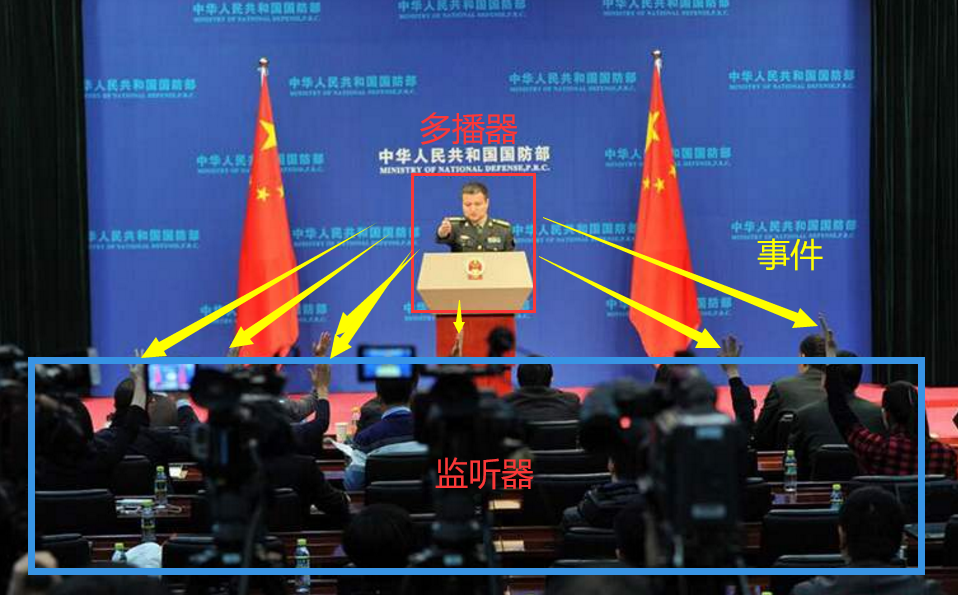
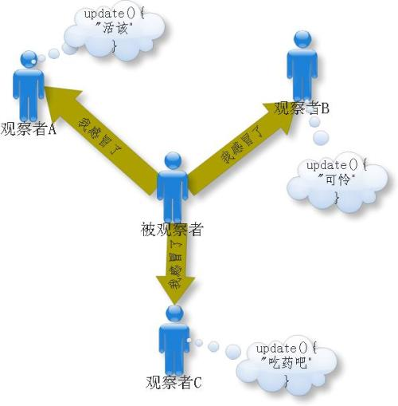
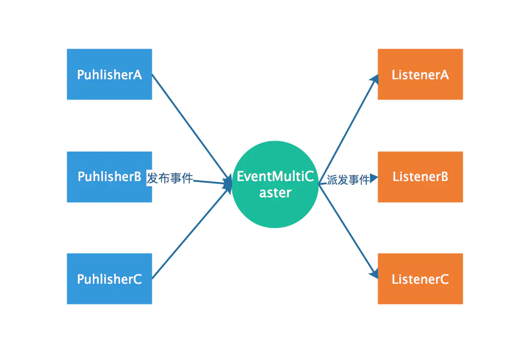
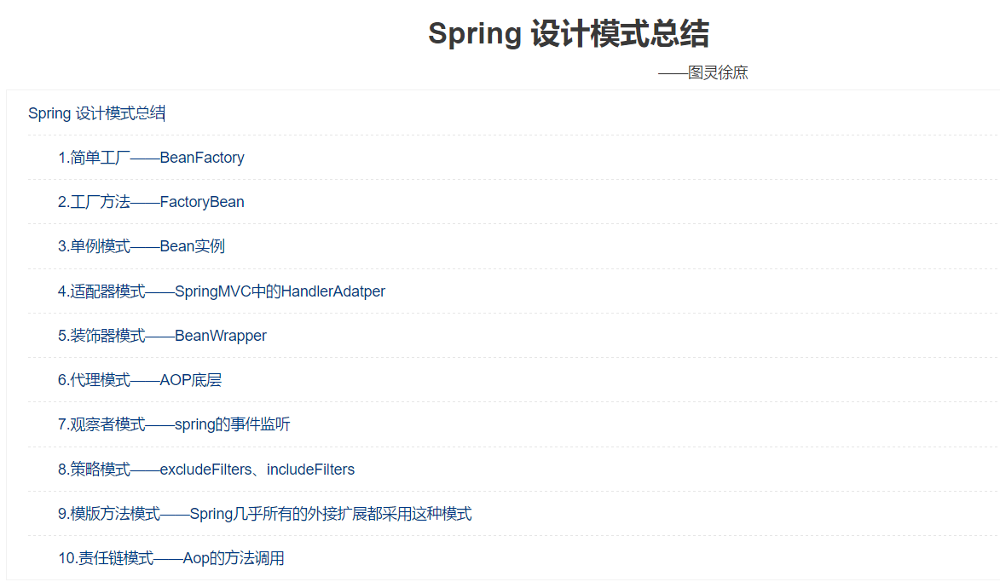
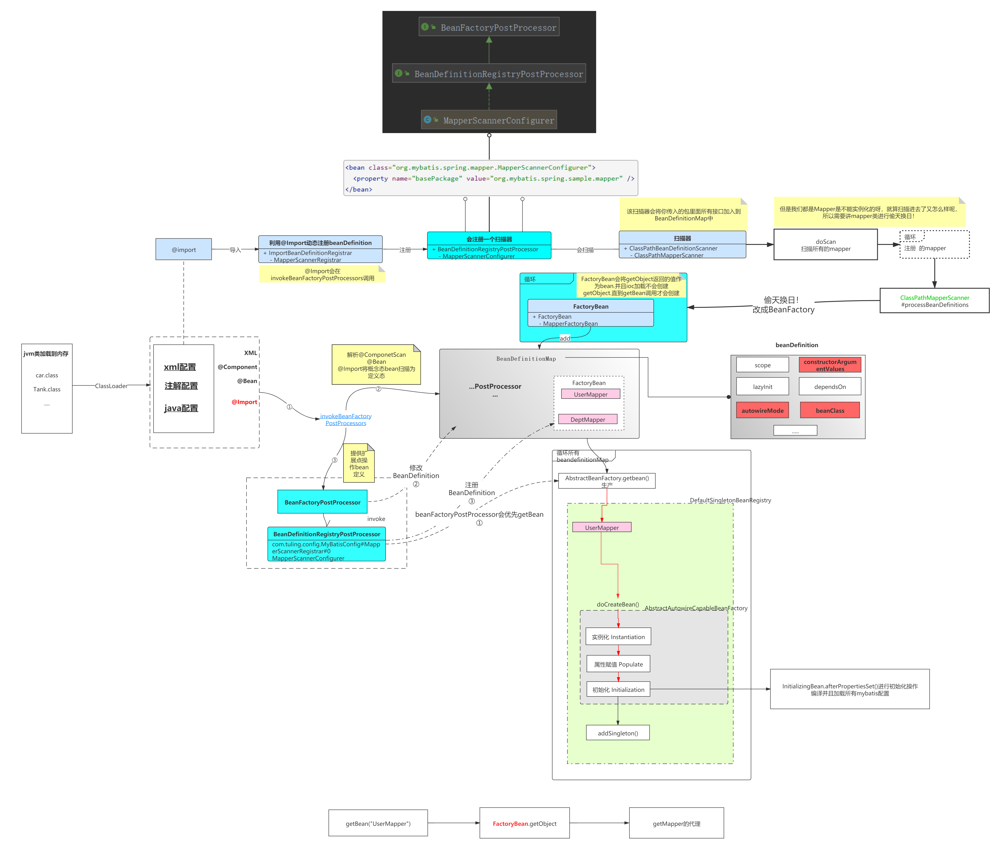

# 七、Spring其他

[返回首页](../README.md)

## 64.Spring事件监听的核心机制是什么？

原理：观察者模式

支持异步：

异步发布事件的核心机制？ 多线程

spring的事件监听有三个部分组成：

- 事件（ApplicationEvent) 负责对应相应监听器 事件源发生某事件是特定事件监听器被触发的原因。

- 监听器(ApplicationListener) 对应于观察者模式中的观察者。监听器监听特定事件,并在内部定义了事件发生后的响应逻辑。

- 事件发布器（ApplicationEventMulticaster ）对应于观察者模式中的被观察者/主题， 负责通知观察者 对外提供发布事件和增删事件监听器的接口,维护事件和事件监听器之间的映射关系,并在事件发生时负责通知相关监听器。

Spring事件机制是观察者模式的一种实现，但是除了发布者和监听者者两个角色之外，还有一个EventMultiCaster的角色负责把事件转发给监听者，工作流程如下：

Spring事件机制

也就是说上面代码中发布者调用applicationEventPublisher.publishEvent(msg); 是会将事件发送给了EventMultiCaster， 而后由EventMultiCaster注册着所有的Listener，然后根据事件类型决定转发给那个Listener。

## 65.Spring 框架中都用到了哪些设计模式？

## 66.Spring是如何整合MyBatis将Mapper接口注册为Bean的原理？

- 首先MyBatis的Mapper接口核心是JDK动态代理

- Spring会排除接口，无法注册到IOC容器中

- MyBatis 实现了BeanDefinitionRegistryPostProcessor 可以动态注册BeanDefinition

- 需要自定义扫描器（继承Spring内部扫描器ClassPathBeanDefinitionScanner ) 重写排除接口的方法（isCandidateComponent）

- 但是接口虽然注册成了BeanDefinition但是无法实例化Bean 因为接口无法实例化

- 需要将BeanDefinition的BeanClass 替换成JDK动态代理的实例（偷天换日）

- Mybatis 通过FactoryBean的工厂方法设计模式可以自由控制Bean的实例化过程，可以在getObject方法中创建JDK动态代理

[上一章](06-spring-transactions.md) · [返回首页](../README.md) · [下一章](08-spring-mvc.md)
