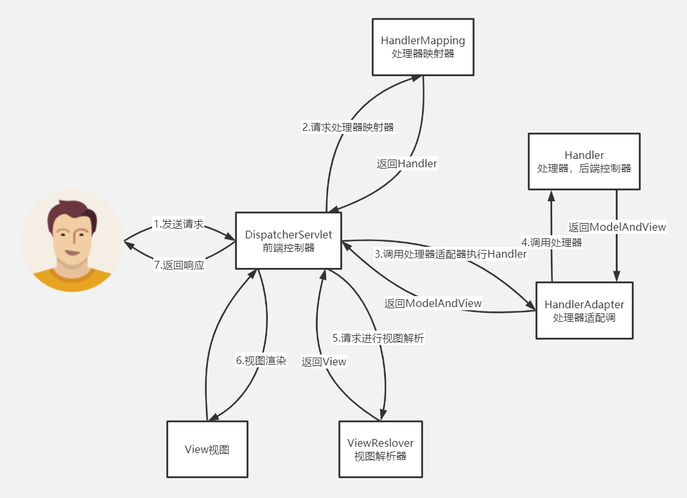
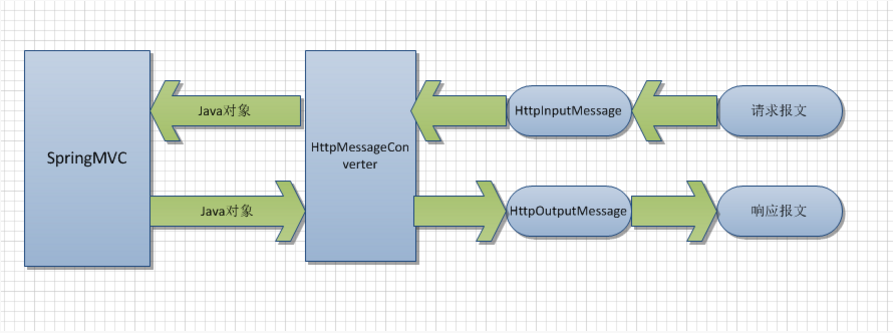
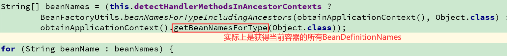
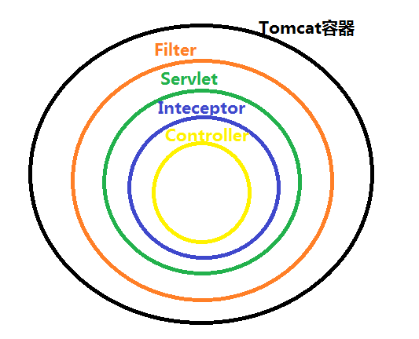
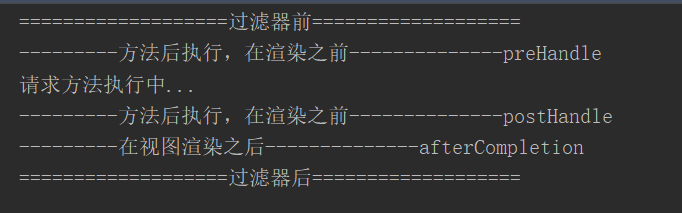

# 八、SpringMVC

[返回首页](../README.md)

## 67.说说你是如何解决 get 和 post 乱码问题？

（1）解决post请求乱码问题：在web.xml中配置一个CharacterEncodingFilter过滤器，设置成utf-8；

```
<filter> <filter-name>CharacterEncodingFilter</filter-name> <filter-class>org.springframework.web.filter.CharacterEncodingFilter</filter-class> <init-param> <param-name>encoding</param-name> <param-value>utf-8</param-value> </init-param></filter> <filter-mapping> <filter-name>CharacterEncodingFilter</filter-name> <url-pattern>/*</url-pattern></filter-mapping>
```

（2）get请求中文参数出现乱码解决方法有两个：

①修改tomcat配置文件添加编码与工程编码一致，如下：

```
<ConnectorURIEncoding="utf-8"connectionTimeout="20000"port="8080"protocol="HTTP/1.1"redirectPort="8443"/>
```

②另外一种方法对参数进行重新编码：

```
String userName= newString(request.getParamter("userName").getBytes("ISO8859-1"),"utf-8")
```

ISO8859-1是tomcat默认编码，需要将tomcat编码后的内容按utf-8编码。

## 68.Spring MVC的控制器是不是单例模式,如果是,有什么问题,怎么解决？

答：是单例模式,所以在多线程访问的时候有线程安全问题,不要用同步,会影响性能的,解决方案是在控制器里面不能写字段。

## 69.请描述Spring MVC的工作流程？描述一下 DispatcherServlet 的工作流程？

（1）用户发送请求至前端控制器DispatcherServlet；

（2） DispatcherServlet收到请求后，调用HandlerMapping处理器映射器，请求获取Handle；

（3）处理器映射器根据请求url找到具体的处理器，生成处理器对象及处理器拦截器(如果有则生成)一并返回给DispatcherServlet；

（4）DispatcherServlet 调用 HandlerAdapter处理器适配器；

（5）HandlerAdapter 经过适配调用 具体处理器(Handler，也叫后端控制器)；

（6）Handler执行完成返回ModelAndView；

（7）HandlerAdapter将Handler执行结果ModelAndView返回给DispatcherServlet；

（8）DispatcherServlet将ModelAndView传给ViewResolver视图解析器进行解析；

（9）ViewResolver解析后返回具体View；

（10）DispatcherServlet对View进行渲染视图（即将模型数据填充至视图中）

（11）DispatcherServlet响应用户。



## 70.SpringMvc怎么和AJAX相互调用的？

（1）加入Jackson.jar

（2）在配置文件中配置json的消息转换器.(jackson不需要该配置HttpMessageConverter）

```
<!--它就帮我们配置了默认json映射--><mvc:annotation-driven conversion-service="conversionService" ></mvc:annotation-driven>
```

（3）在接受Ajax方法里面可以直接返回Object,List等,但方法前面要加上@ResponseBody注解。



springMVC对数据Message的处理操作提供了一个接口HttpMessageConverter，用来对参数值和返回值的转换处理。在请求和返回过程中可以进行转换json

## 71.Spring和SpringMVC为什么需要父子容器？

就功能性来说不用子父容器也可以完成（参考：SpringBoot就没用子父容器）

- 所以父子容器的主要作用应该是划分框架边界。有点职责单一的味道。service、dao层我们一般使用spring框架来管理、controller层交给springmvc管理

- 规范整体架构 使 父容器service无法访问子容器controller、子容器controller可以访问父容器 service

- 方便子容器的切换。如果现在我们想把web层从spring mvc替换成struts，那么只需要将spring-mvc.xml替换成Struts的配置文件struts.xml即可，而spring-core.xml不需要改变。

## 72.是否可以把所有Bean都通过Spring容器来管理？（Spring的applicationContext.xml中配置全局扫描)

不可以，这样会导致我们请求接口的时候产生404。 如果所有的Bean都交给父容器，SpringMVC在初始化HandlerMethods的时候（initHandlerMethods）无法根据Controller的handler方法注册HandlerMethod，并没有去查找父容器的bean；

也就无法根据请求URI 获取到 HandlerMethod来进行匹配.



## 73.是否可以把我们所需的Bean都放入Spring-mvc子容器里面来管理（springmvc的spring-servlet.xml中配置全局扫描）?

可以 ， 因为父容器的体现无非是为了获取子容器不包含的bean, 如果全部包含在子容器完全用不到父容器了， 所以是可以全部放在springmvc子容器来管理的。

虽然可以这么做不过一般应该是不推荐这么去做的，一般人也不会这么干的。如果你的项目里有用到事物、或者aop记得也需要把这部分配置需要放到Spring-mvc子容器的配置文件来，不然一部分内容在子容器和一部分内容在父容器,可能就会导致你的事物或者AOP不生效。 所以如果aop或事物如果不生效也有可能是通过父容器(spring)去增强子容器(Springmvc)，也就无法增强。

## 74.如何实现无XML零配置的SpringMVC

- 省略web.xml

- servlet3.0之后规范中提供了SPI扩展:META-INF/services/javax.servlet.ServletContainerInitializer

- SpringMVC通过实现ServletContainerInitializer接口

- 动态注册ContextLoaderListener 和DispatcherServlet并创建子父容器(Application)

- 省略spring.xml和spring-mvc.xml(只是sprinmvc方式 ，springboot在自动配置类完成) 配置类--xml

- 实现一个继承AbstractAnnotationConfigDispatcherServletInitializer的类

- 该类就实现了ServletContainerInitializer，它会创建ContextLoaderListener 和DispatcherServlet

- 还会创建父子容器， 创建容器时传入父子容器配置类则可以替代spring.xml和spring-mvc.xml

## 75.SpringMVC的拦截器和过滤器有什么区别？执行顺序？

拦截器不依赖与servlet容器，过滤器依赖与servlet容器。

拦截器只能对action请求(DispatcherServlet 映射的请求)起作用，而过滤器则可以对几乎所有的请求起作用。

拦截器可以访问容器中的Bean(DI)，而过滤器不能访问（基于spring注册的过滤器也可以访问容器中的bean）。

执行顺序：





多个过滤器的执行顺序跟xml文件中定义的先后关系有关

当然，对于多个拦截器它们之间的执行顺序跟在SpringMVC的配置文件中定义的先后顺序有关。

[上一章](07-spring-other.md) · [返回首页](../README.md) · [下一章](09-spring-boot.md)
