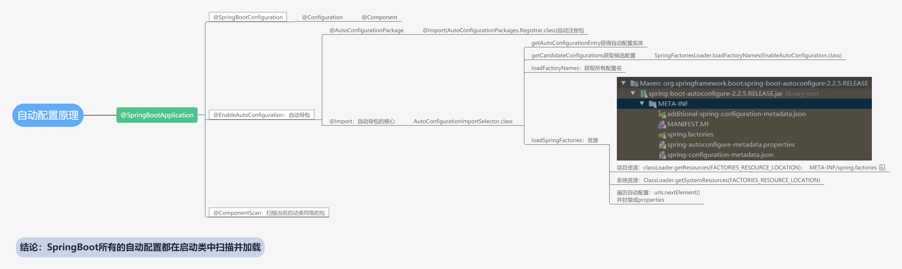
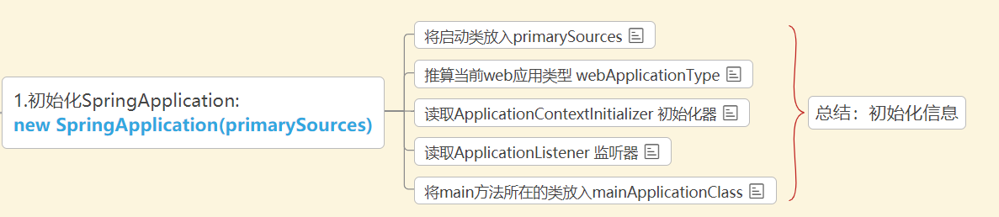
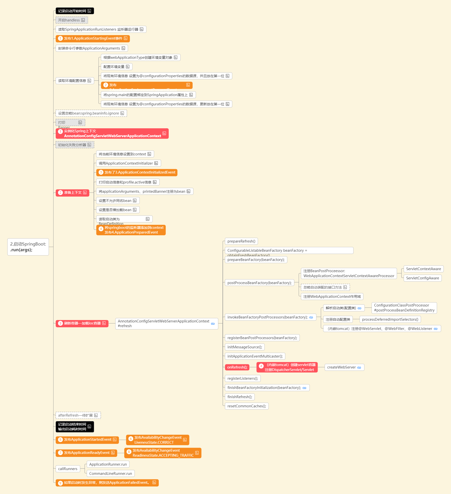
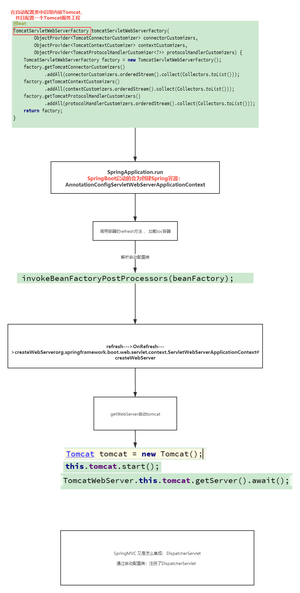
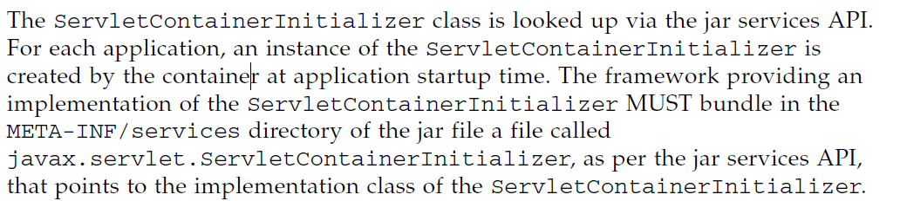
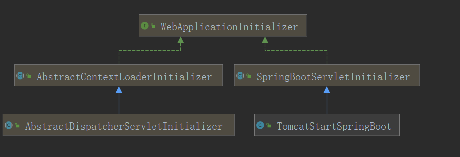
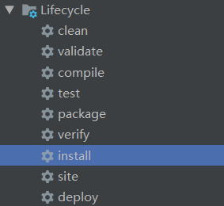
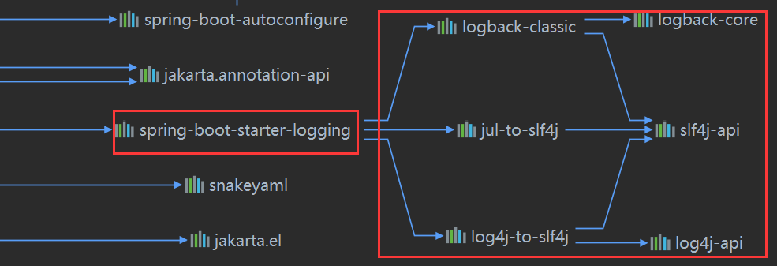

# 九、Spring Boot

[返回首页](../README.md)

## 76.谈谈你对SpringBoot的理解，它有哪些特性（优点）？

SpringBoot的用来快速开发Spring应用的一个脚手架、其设计目的是用来简新Spring应用的初始搭建以及开发过程。

## 1.SpringBoot提供了很多内置的Starter结合自动配置，对主流框架无配置集成、开箱即用。

## 2.SpringBoot简化了开发，采用JavaConfig的方式可以使用零xml的方式进行开发；

## 2.SpringBoot内置Web容器无需依赖外部Web服务器，省略了Web.xml，直接运行jar文件就可以启动web应用；

## 4.SpringBoot帮我管理了常用的第三方依赖的版本，减少出现版本冲突的问题；

## 5.SpringBoot自带了监控功能，可以监控应用程序的运行状况，或者内存、线程池、Http 请求统计等，同时还提供了优雅关闭应用程序等功能。

## 77.Spring和SpringBoot的关系和区别？

SpringBoot是Spring生态的产品。

Spring Framework是一个容器框架

SpringBoot 它不是一个框架、它是一个可以快速构建基于Spring的脚手架(里面包含了Spring和各种框架），为开发Spring生态其他框架铺平道路

2个不是一个层面的东西， 没有可比性。

## 78.SpringBoot的核心注解

- @SpringBootApplication注解：这个注解标识了一个SpringBoot工程，它实际上是另外三个注解的组合，这三个注解是：

- @SpringBootConfiguration：这个注解实际就是一个@Configuration，表示启动类也是一个配置类

- @EnableAutoConfiguration：向Spring容器中导入了一个Selector，用来加载ClassPath下SpringFactories中所定义的自动配置类，将这些自动加载为配置Bean

- @Conditional 也很关键， 如果没有它我们无法在自定义应用中进行定制开发

- @ConditionalOnBean、

- @ConditionalOnClass、

- @ConditionalOnExpression、

- @ConditionalOnMissingBean等。

## 79.springboot的自动配置原理？

## 1.通过@SpringBootConfiguration 引入了@EnableAutoConfiguration (负责启动自动配置功能）

## 2.@EnableAutoConfiguration 引入了@Import

## 3.Spring容器启动时：加载Ioc容器时会解析@Import 注解

## 4.@Import导入了一个deferredImportSelector(它会使SpringBoot的自动配置类的顺序在最后，这样方便我们扩展和覆盖？)

## 5.然后读取所有的/META-INF/spring.factories文件（SPI)

## 6.过滤出所有AutoConfigurtionClass类型的类

## 7.最后通过@ConditioOnXXX排除无效的自动配置类



## 80.为什么SpringBoot的jar可以直接运行？

## 1.SpringBoot提供了一个插件spring-boot-maven-plugin用于把程序打包成一个可执行的jar包。

## 2.Spring Boot应用打包之后，生成一个Fat jar(jar包中包含jar)，包含了应用依赖的jar包和Spring Boot loader相关的类。

## 3.java -jar会去找jar中的manifest文件，在那里面找到真正的启动类（Main-Class）；

## 4.Fat jar的启动Main函数是JarLauncher，它负责创建一个LaunchedURLClassLoader来加载boot-lib下面的jar，并以一个新线程启动应用的启动类的Main函数（找到manifest中的Start-Class）。

## 81.SpringBoot的启动原理？

## 1.运行main方法： 初始化new SpringApplication 从spring.factories 读取 listener ApplicationContextInitializer 。



## 2.运行run方法

## 3.读取 环境变量 配置信息.....

## 4. 创建springApplication上下文:ServletWebServerApplicationContext

## 5. 预初始化上下文 ： 将启动类作为配置类进行读取-->将配置注册为BeanDefinition

## 6.调用refresh 加载ioc容器

invokeBeanFactoryPostProcessor -- 解析@Import: 加载所有的自动配置类

onRefresh 创建(内置)servlet容器

## 7.在这个过程中springboot会调用很多监听器对外进行扩展



## 82.SpringBoot内置Tomcat启动原理？

- 当依赖Spring-boot-starter-web依赖时会在SpringBoot中添加：ServletWebServerFactoryAutoConfiguration servlet容器自动配置类

- 该自动配置类通过@Import导入了可用(通过@ConditionalOnClass判断决定使用哪一个)的一个Web容器工厂（默认Tomcat)

- 在内嵌Tomcat类中配置了一个TomcatServletWebServerFactory的Bean（Web容器工厂）

- 它会在SpringBoot启动时 加载ioc容器(refresh) OnRefersh 创建内嵌的Tomcat并启动



## 83.SpringBoot外置Tomcat启动原理？

```
public classTomcatStartSpringBootextendsSpringBootServletInitializer{ @Override protectedSpringApplicationBuilder(SpringApplicationBuilder builder) { returnbuilder.sources(Application.class); }}
```

servlet3.0 规范官方文档： 8.2.4



大概： 当servlet容器启动时候 就会去META-INF/services 文件夹中找到javax.servlet.ServletContainerInitializer, 这个文件里面肯定绑定一个ServletContainerInitializer. 当servlet容器启动时候就会去该文件中找到ServletContainerInitializer的实现类，从而创建它的实例调用onstartUp

- @HandlesTypes(WebApplicationInitializer.class).

- @HandlesTypes传入的类为ServletContainerInitializer感兴趣的

- 容器会自动在classpath中找到 WebApplicationInitializer 会传入到onStartup方法的webAppInitializerClasses中

- Set<Class<?>> webAppInitializerClasses 这里面也包括之前定义的TomcatStartSpringBoot

```
@HandlesTypes(WebApplicationInitializer.class)public classSpringServletContainerInitializerimplementsServletContainerInitializer{@Overridepublic void onStartup(@NullableSet<Class<?>>webAppInitializerClasses,ServletContext servletContext) throwsServletException{List<WebApplicationInitializer>initializers= newLinkedList<>(); if (webAppInitializerClasses!=null) { for (Class<?>waiClass:webAppInitializerClasses) { // 如果不是接口 不是抽象 跟WebApplicationInitializer有关系 就会实例化 if (!waiClass.isInterface() && !Modifier.isAbstract(waiClass.getModifiers()) &&WebApplicationInitializer.class.isAssignableFrom(waiClass)) { try {initializers.add((WebApplicationInitializer)ReflectionUtils.accessibleConstructor(waiClass).newInstance()); } catch (Throwable ex) { throw newServletException("Failed to instantiate WebApplicationInitializer class",ex); } } } } if (initializers.isEmpty()) {servletContext.log("No Spring WebApplicationInitializer types detected on classpath"); return; }servletContext.log(initializers.size() + " Spring WebApplicationInitializers detected on classpath"); // 排序AnnotationAwareOrderComparator.sort(initializers); for (WebApplicationInitializer initializer:initializers) {initializer.onStartup(servletContext); }}
```



```
@Overridepublic void onStartup(ServletContext servletContext) throwsServletException{ // Logger initialization is deferred in case an ordered // LogServletContextInitializer is being used this.logger=LogFactory.getLog(getClass());WebApplicationContext rootApplicationContext= createRootApplicationContext(servletContext); if (rootApplicationContext!=null) {servletContext.addListener(newSpringBootContextLoaderListener(rootApplicationContext,servletContext)); } else { this.logger.debug("No ContextLoaderListener registered, as createRootApplicationContext() did not " + "return an application context"); }}
```

- SpringBootServletInitializer

- 之前定义的TomcatStartSpringBoot 就是继承它

```
protectedWebApplicationContextcreateRootApplicationContext(ServletContext servletContext) {SpringApplicationBuilder builder= createSpringApplicationBuilder();builder.main(getClass());ApplicationContext parent= getExistingRootWebApplicationContext(servletContext); if (parent!=null) { this.logger.info("Root context already created (using as parent).");servletContext.setAttribute(WebApplicationContext.ROOT_WEB_APPLICATION_CONTEXT_ATTRIBUTE,null);builder.initializers(newParentContextApplicationContextInitializer(parent)); }builder.initializers(newServletContextApplicationContextInitializer(servletContext));builder.contextClass(AnnotationConfigServletWebServerApplicationContext.class); // 调用configurebuilder= configure(builder);builder.listeners(newWebEnvironmentPropertySourceInitializer(servletContext));SpringApplication application=builder.build(); if (application.getAllSources().isEmpty() &&MergedAnnotations.from(getClass(),SearchStrategy.TYPE_HIERARCHY).isPresent(Configuration.class)) {application.addPrimarySources(Collections.singleton(getClass())); }Assert.state(!application.getAllSources().isEmpty(), "No SpringApplication sources have been defined. Either override the " + "configure method or add an @Configuration annotation"); // Ensure error pages are registered if (this.registerErrorPageFilter) {application.addPrimarySources(Collections.singleton(ErrorPageFilterConfiguration.class)); }application.setRegisterShutdownHook(false); return run(application);}
```

- 当调用configure就会来到TomcatStartSpringBoot .configure

- 将Springboot启动类传入到builder.source

```
@OverrideprotectedSpringApplicationBuilderconfigure(SpringApplicationBuilder builder) { returnbuilder.sources(Application.class);}
```

// 调用SpringApplication application = builder.build(); 就会根据传入的Springboot启动类来构建一个SpringApplication

```
publicSpringApplicationbuild(String...args) { configureAsChildIfNecessary(args); this.application.addPrimarySources(this.sources); return this.application;}
```

// 调用 return run(application); 就会帮我启动springboot应用

```
protectedWebApplicationContextrun(SpringApplication application) { return (WebApplicationContext)application.run();}
```

它就相当于我们的

```
public static void main(String[]args) {SpringApplication.run(Application.class,args);}
```

## 84.会不会SpringBoot自定义Starter？大概实现过程？

## 2. HelloProperties

```
packagecom.starter.tulingxueyuan;importorg.springframework.boot.context.properties.ConfigurationProperties;/*** * @Author徐庶 QQ:1092002729 * @Slogan致敬大师，致敬未来的你 */@ConfigurationProperties("tuling.hello")public classHelloProperties{ privateString name; publicStringgetName() { returnname; } public void setName(String name) { this.name=name; }}
```

## 3. IndexController

```
packagecom.starter.tulingxueyuan;importorg.springframework.beans.factory.annotation.Autowired;importorg.springframework.web.bind.annotation.RequestMapping;importorg.springframework.web.bind.annotation.RestController;/*** * @Author徐庶 QQ:1092002729 * @Slogan致敬大师，致敬未来的你 */@RestControllerpublic classIndexController{HelloProperties helloProperties; public IndexController(HelloProperties helloProperties) { this.helloProperties=helloProperties; } @RequestMapping("/") publicStringindex(){ returnhelloProperties.getName()+"欢迎您"; }}
```

## 4. HelloAutoConfitguration

```
packagecom.starter.tulingxueyuan;importorg.springframework.beans.factory.annotation.Autowired;importorg.springframework.boot.autoconfigure.condition.ConditionalOnProperty;importorg.springframework.boot.context.properties.EnableConfigurationProperties;importorg.springframework.context.annotation.Bean;importorg.springframework.context.annotation.Configuration;/*** * @Author徐庶 QQ:1092002729 * @Slogan致敬大师，致敬未来的你 * *给web应用自动添加一个首页 */@Configuration@ConditionalOnProperty(value= "tuling.hello.name")@EnableConfigurationProperties(HelloProperties.class)public classHelloAutoConfitguration{ @AutowiredHelloProperties helloProperties; @Bean publicIndexControllerindexController(){ return newIndexController(helloProperties); }}
```

## 5. spring.factories

在 resources 下创建文件夹 META-INF 并在 META-INF 下创建文件 spring.factories ，内容如下：


```
org.springframework.boot.autoconfigure.EnableAutoConfiguration=\com.starter.tulingxueyuan.HelloAutoConfitguration
```

到这儿，我们的配置自定义的starter就写完了 ，我们hello-spring-boot-starter-autoconfigurer、hello-spring-boot-starter 安装成本地jar包。



## 85.SpringBoot读取配置文件的原理是什么？加载顺序是怎样的?

通过事件监听的方式读取的配置文件：ConfigFileApplicationListener

优先级从高到低，高优先级的配置覆盖低优先级的配置，所有配置会形成互补配置。

```
*<ul>*<li>file:./config/</li>*<li>file:./config/xxx/application.properties</li>*<li>file:./application.properties</li>*<li>classpath:config/</li>*<li>classpath:</li>*</ul>
```

## 86.SpringBoot的默认日志实现框架是什么？怎么切换成别的？



总结：

- SpringBoot底层也是使用slf4j+logback的方式进行日志记录

- logback桥接：logback-classic

- SpringBoot也把其他的日志都替换成了slf4j；

- log4j 适配： log4j-over-slf4j

- jul适配：jul-to-slf4j

- 这两个适配器都是为了适配Spring的默认日志：jc

- 切换日志框架

- 将 logback切换成log4j2

- 将logback的场景启动器排除（slf4j只能运行有1个桥接器）

- 添加log4j2的场景启动器

- 添加log4j2的配置文件

```
<dependencies> <dependency> <!--starter-web里面自动添加starter-logging 也就是logback的依赖--> <groupId>org.springframework.boot</groupId> <artifactId>spring-boot-starter-web</artifactId> <exclusions> <!--排除starter-logging 也就是logback的依赖--> <exclusion> <artifactId>spring-boot-starter-logging</artifactId> <groupId>org.springframework.boot</groupId> </exclusion> </exclusions> </dependency> <!--Log4j2的场景启动器--> <dependency> <groupId>org.springframework.boot</groupId> <artifactId>spring-boot-starter-log4j2</artifactId> </dependency></dependencies>
```

- 将 logback切换成log4j

- 要将logback的桥接器排除

```
<dependency> <!--starter-web里面自动添加starter-logging 也就是logback的依赖--> <groupId>org.springframework.boot</groupId> <artifactId>spring-boot-starter-web</artifactId> <exclusions> <exclusion> <artifactId>logback-classic</artifactId> <groupId>ch.qos.logback</groupId> </exclusion> </exclusions></dependency>
```

- 添加log4j的桥接器

```
<dependency> <groupId>org.slf4j</groupId> <artifactId>slf4j-log4j12</artifactId></dependency>
```

- 添加log4j的配置文件

log4j.properties

```
#trace<debug<info<warn<error<fatallog4j.rootLogger=trace, stdoutlog4j.appender.stdout=org.apache.log4j.ConsoleAppenderlog4j.appender.stdout.layout=org.apache.log4j.PatternLayoutlog4j.appender.stdout.layout.ConversionPattern=%d %p [%c] - %m%n
```

## 87.说说你在开发的时候怎么在SpringBoot的基础上做扩展？

首先肯定要确认你扩展的技术点（比如扩展的是aop)

打开aop自动配置类:

重点关注@ConditionalOnXXX 它可以帮助开启或关闭 某些功能

深入看源码 有些自动配置类 提供对外的扩展接口、实现接口也可以进行扩展

[上一章](08-spring-mvc.md) · [返回首页](../README.md) · [下一章](10-microservices.md)
