# 十、微服务

[返回首页](../README.md)

## 88、微服务架构的优缺点

1. 演变而来（从单体应用演变过来）

2. 初期评估起手就上微服务

分工协作

- 单体：影响开发效率,发布和迭代性差；项目启动慢， 每个人对整体的项目都要有所把握； 业务缩减后如果语言不一致开发人员面临流失。

- 拆分：提高开发效率和敏捷性·；单个服务启动快， 专人处理专事专注自己的服务； 充分利用项目开发人员（哪怕是不同的语言不同框架，不同存储技术，也可以）

并发能力

- 单体：整体集群，易造成系统资源浪费； 之前下单功能要去集群无法准确评测最大并发量， 因为所有的功能都在一起，无法准确预估扩容的服务器。

- 拆分：服务集群，充分利用服务器资源； 现在只需要针对下单服务进行压测就可以得到，下单功能具体能承受的并发量最高水位，从而更准确的进行扩容。

维护能力（维护困难）

- 单体：随着业务量增加，应用慢慢膨胀，后续可能会变得牵一发而动全身，难以维护。

- 拆分：根据功能垂直拆分，责任更加分明，维护更加精准。

容错

- 单体：单点故障，一个功能OOM导致整个应用都不可用

- 拆分：弱依赖的服务出现故障，可以进行熔断（隔离） 依然不影响主业务正常使用

扩展

- 单体：难以技术升级

- 拆分：新的服务采用任意新技术（技术多样性）

缺点

分布式

分布式系统较难编程，因为远程调用速度很慢，并且总是面临失败的风险。对于开发人员的技术要求更高

最终一致性

对于分布式系统而言，保持强一致性非常困难，这意味着每个人都必须管理最终一致性。

运维复杂性

微服务必定带来开发、上线、运维的复杂度的提高，如果说单体应用复杂度为 10，实施了微服务后的复杂度将是 100，配备了相应的工具和平台后，可以将复杂度降低到 50，但仍然比单体复杂的多。

隐式接口

服务和服务之间通过接口来“联系”，当某一个服务更改接口格式时，可能涉及到此接口的所有服务都需要做调整。

重复劳动

在很多服务中可能都会使用到同一个功能，而这一功能点没有足够大到提供一个服务的程度，这个时候可能不同的服务团队都会单独开发这一功能，重复的业务逻辑，这违背了良好的软件工程中的很多原则。

## 89.SOA、分布式、微服务之间有什么关系和区别？

1分布式架构是指将单体架构中的各个部分拆分，然后部署不同的机器或进程中去，SOA和微服务基本上都是分布式架构的

2SOA是一种面向服务的架构，系统的所有服务都注册在总线上，当调用服务时，从总线上查找服务信息，然后调用

3微服务是一种更彻底的面向服务的架构，将系统中各个功能个体抽成一个个小的应用程序，基本保持一个应用对应的一个服务的架构

## 90.怎么拆分微服务、拆分时机是什么？

怎么拆：

1、高内聚低耦合，职责单一，服务粒度适中，服务不要太细（有的团队甚至一个接口一个服务，一个表一个服务）

2、以业务模型切入：比如产品，用户，订单为一个模型来切入）

3、演进式拆分：刚开始不要划分太细，可以随着迭代过程来逐步优化。

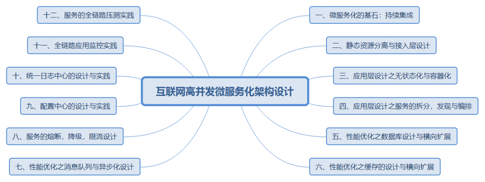

微服务 1.0，仅使用注册发现，基于 SpringCloud 或者 Dubbo 进行开发，目前意图实施微服务的传统企业大部分处于这个阶段，或者正从单体应用，向这个阶段过渡，处于 0.5 的阶段；

微服务 2.0，使用了熔断，限流，降级等服务治理策略，并配备完整微服务工具和平台，目前大部分互联网企业处于这个阶段。传统企业中的领头羊，在做互联网转型的过程中，正在向这个阶段过渡，处于 1.5 的阶段；

微服务 3.0，Service Mesh 将服务治理作为通用组件，下沉到平台层实现，使得应用层仅仅关注业务逻辑，平台层可以根据业务监控自动调度和参数调整，实现 AIOps 和智能调度。目前一线互联网公司在进行这方面的尝试。

拆分时机：

业务量足够大，足够成本（投入成本、时间成本）

首先，如果是预估到业务在飞速增长，那就别犹豫，一定要提前考虑微服务的拆分。

其次，如果在设计架构的时候，发现需要很多异构的技术栈，那也要考虑下微服务。

最后，如果公司技术基础设施非常完备，对应的业务起初就设计的非常复杂，那么也别犹豫，起手就上微服务。

## 91.Spring Cloud有哪些常用组件，作用是什么？

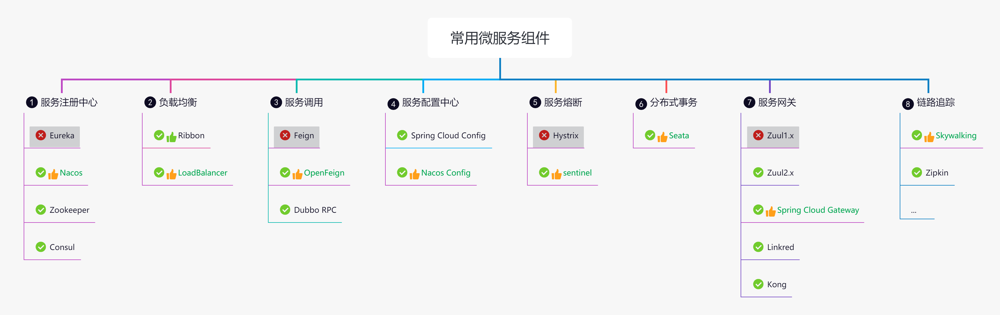

- 注册中心：管理服务

- 负载均衡：客户端的负载均衡器

- 服务调用：使远程服务调用更加优雅

- 配置中心：管理服务的配置

- 服务熔断：保证应用高可用 防止出现服务雪崩，防止激增流量打垮冷系统.....

- 分布式事务：Seata

- 网关：为客户端提供统一的服务，一些跟业务本身功能无光的公共逻辑都可以放在网关实现：鉴权、日志、限流、跨域、路由转发....

- 链路追踪：实时追踪服务的监控状况，协助快速恢复

## 92.注册中心的原理是什么？

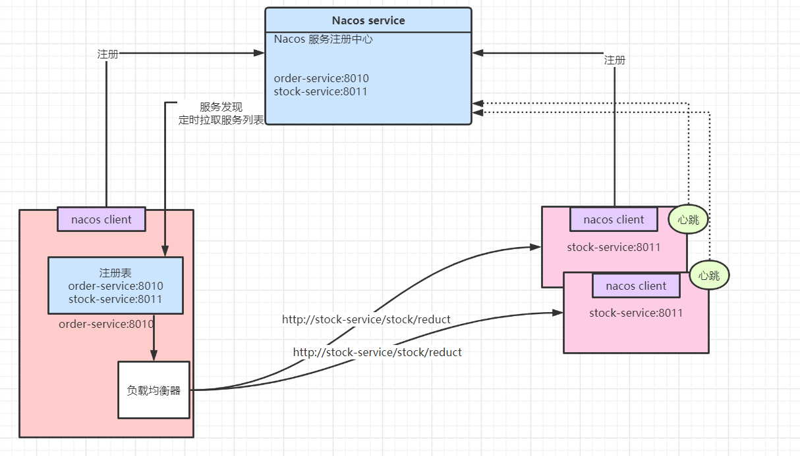

服务注册： 当服务启动 通过Rest请求的方式向Nacos Server注册自己的服务

服务心跳：Nacose Client 会维护一个定时心跳持续通知Nacos Server , 默认5s一次， 如果nacos Client超过了15秒没有接收心跳，会将服务健康状态设置false（拉取的时候会忽略）, 如果nacos Client超过了30 秒没有接收心跳 剔除服务。

服务发现：Nacose Client 会有一个定时任务，实时去Nacos Server 拉取健康服务

服务停止： Nacose Client 会主动通过Rest请求Nacos Server 发送一个注销的请求

## 93.谈谈配置中心？

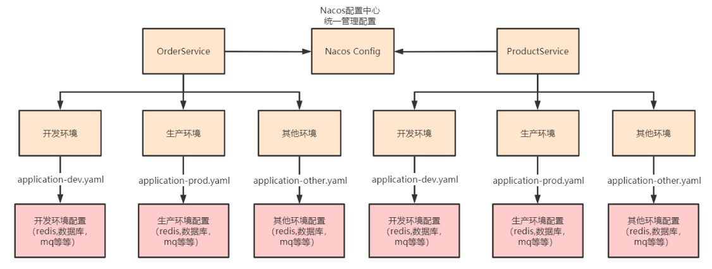

集中管理服务的配置、提高维护性、时效性、安全性

有哪些东西可以作为配置？

比方说，数据库连接Url，缓存连接url字符串，数据库的用户名，密码都可以作为配置的字符串，除此之外，还有一些可以动态调整的参数，比方说，客户端的超时设置限流规则和降级开关，流量的动态调度，比方说某个功能只是针对某个地区用户，还有某个功能只在大促的时段开放，如果这种需要通过静态的方式去配置或者发布的方式去配置，那么响应速度是非常慢，可能对业务存在风险，如果有一套集中式的配置中心，只需要相关人员在配置中心动态去调整参数，就基本上可以实时或准实时去调整相关对应的业务。所以配置中心在微服务中算是一个举足轻重的组件。

推还是拉

现在我们了解了 Nacos 的配置管理的功能了，但是有一个问题我们需要弄明白，那就是 Nacos 客户端是怎么实时获取到 Nacos 服务端的最新数据的。

其实客户端和服务端之间的数据交互，无外乎两种情况：

- 服务端推数据给客户端

- 客户端从服务端拉数据

那到底是推还是拉呢，从 Nacos 客户端通过 Listener 来接收最新数据进行分析

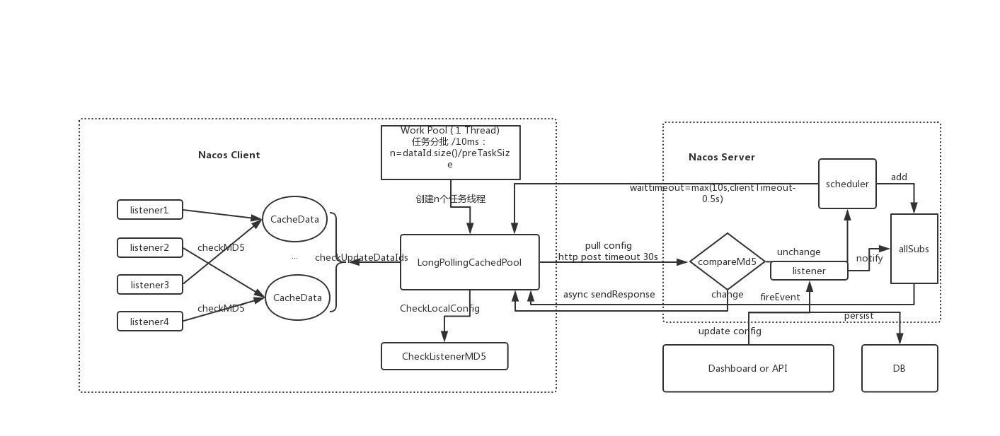

原理：

Nacos 服务端创建了相关的配置项后，客户端就可以进行监听了。

客户端是通过一个定时任务来检查自己监听的配置项的数据的，一旦服务端的数据发生变化时，客户端将会获取到最新的数据，并将最新的数据保存在一个 CacheData 对象中，然后会重新计算 CacheData 的 md5 属性的值，此时就会对该 CacheData 所绑定的 Listener 触发 receiveConfigInfo（接收配置信息） 回调。

拉的优势

客户端拉取服务端的数据与服务端推送数据给客户端相比，优势在哪呢，为什么 Nacos 不设计成主动推送数据，而是要客户端去拉取呢？如果用推的方式，服务端需要维持与客户端的长连接，这样的话需要耗费大量的资源，并且还需要考虑连接的有效性，例如需要通过心跳来维持两者之间的连接。而用拉的方式，客户端只需要通过一个无状态的 http 请求即可获取到服务端的数据。

## 94.说说服务网关可以做什么？

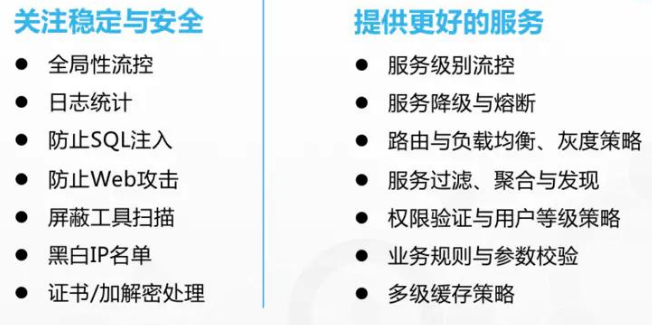

- 面对互联网复杂的业务系统，基本可以将服务网关分成两类：流量网关和业务网关。

流量网关：跟具体的后端业务系统和服务完全无关的部分，比如安全策略、全局性流控策略、流量分发策略等。

业务网关：针对具体的后端业务系统，或者是服务和业务有一定关联性的部分，并且一般被直接部署在业务服务的前面。业务网关一般部署在流量网关之后，业务系统之前，比流量网关更靠近系统。我们大部分情况下说的 API 网关，狭义上指的是业务网关。并且如果系统的规模不大，我们也会将两者合二为一，使用一个网关来处理所有的工作

## 95.什么是服务雪崩？什么是服务限流？

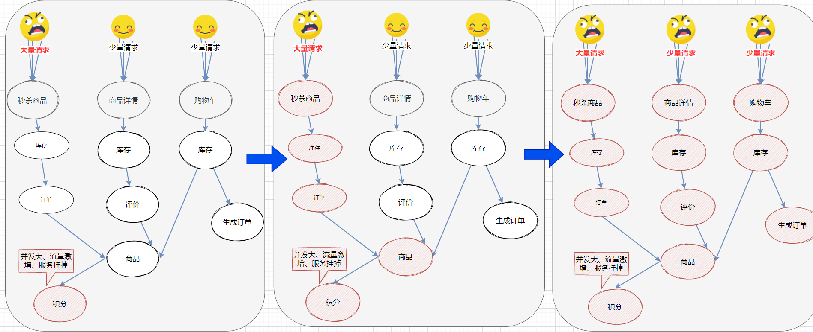

服务雪崩效应： 因服务提供者的不可用导致服务调用者的不可用,并将不可用逐渐放大的过程，就叫服务雪崩效应

解决方式：

- 通过熔断机制，当一个服务挂了，被影响的服务能够及时熔断，使用 Fallback 数据保证流程在非关键服务不可用的情况下，仍然可以进行。

- 通过线程池和消息队列机制实现异步化，允许服务快速失败，当一个服务因为过慢而阻塞，被影响服务可以在超时后快速失败，不会影响整个调用链路。

服务限流

是指在高并发请求下，为了保护系统，可以对访问服务的请求进行数量上的限制，从而防止系统不被大量请求压垮，在秒杀中，限流是非常重要的。

## 96.什么是服务熔断？什么是服务降级？区别是什么？

1服务熔断（终止交易），当服务A调用的某个服务B不可用时，上游服务A为了保证自己不受影响，及时切断与服务B的通讯。以防服务雪崩。 防止服务雪崩一种措施

2.服务降级（执行B计划）：提前预想好另外一种兜底措施， 可以进行后期补救。 直到服务B恢复，再恢复和B服务的正常通讯。 当被调用服务不可用时的一种兜底措施。

## 97.说说Seata的实现原理？

在应用中Seata整体事务逻辑基于两阶段提交的模型，核心概念包含三个角色：

- TC：事务协调者，即独立运行的seata-server，用于接收事务注册，提交和回滚。

- TM：事务发起者。用来告诉TC全局事务的开始，提交，回滚。

- RM：事务资源，每一个RM都会作为一个分支事务注册在TC。

AT(Auto Transaction)模式

第一阶段

过程：

- TM 向 TC 申请开启一个全局事务，全局事务创建并生成一个全局唯一的XID。

- XID 在微服务调用链路的上下文中传播。

假设运行：update product set name = 'GTS' where name = 'TXC'; // id=1

- 解析 SQL：得到 SQL 的类型（UPDATE），表（product），条件（where name = 'TXC'）等相关的信息。

- 查询前镜像：根据解析得到的条件信息，生成查询语句，定位数据。 select * from product where name = 'TXC' 镜像前数据

- 执行业务 SQL：更新这条记录的 name 为 'GTS'。

- 查询后镜像：根据前镜像的结果，通过 主键 定位数据。select * from produc where name = 'TXC' 镜像后数据

- 插入回滚日志：把前后镜像数据以及业务 SQL 相关的信息组成一条回滚日志记录，插入到 UNDO_LOG 表中。

- 提交前，RM 向 TC 注册分支：申请 product 表中，主键值等于 1 的记录的 全局锁 。

- 本地事务提交：业务数据的更新和前面步骤中生成的 UNDO LOG 一并提交。

- TM 向 TC 发起针对 XID 的全局提交或回滚决议。将本地事务提交的结果上报给 TC

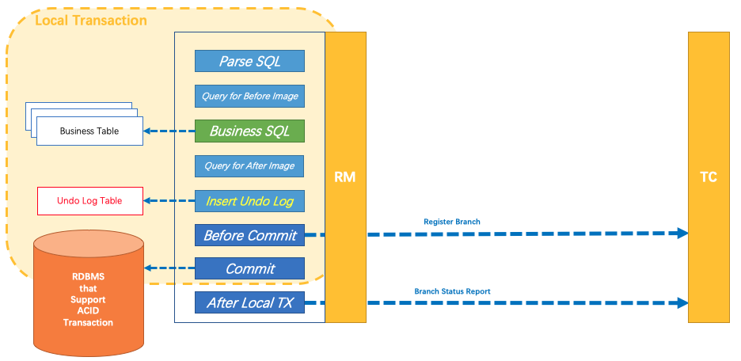

二阶段-提交

- TC 调度 XID 下管辖的全部分支事务完成提交或回滚请求。

- 收到 TC 的分支提交请求，把请求放入一个异步任务的队列中，马上返回提交成功的结果给 TC。

- 异步任务阶段的分支:提交请求,将异步和批量地删除相应 UNDO LOG 记录。

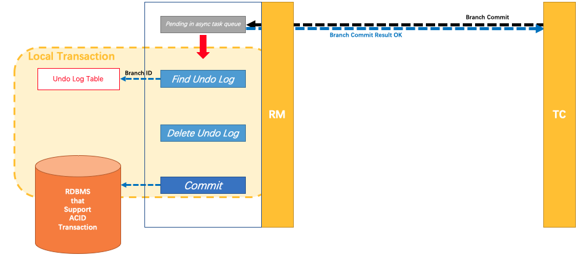

二阶段-回滚

- TC 调度 XID 下管辖的全部分支事务完成提交或回滚请求。

- 收到 TC 的分支回滚请求，开启一个本地事务，执行如下操作。

- 通过 XID 和 Branch ID 查找到相应的 UNDO LOG 记录。

- 数据校验：拿 UNDO LOG 中的后镜与当前数据进行比较，如果有不同，说明数据被当前全局事务之外的动作做了修改（出现脏写），转人工处理（Seata 因为无法感知这个脏写如何发生，此时只能打印日志和触发异常通知，告知用户需要人工介入）

- 人工没有脏写就简单了：根据 UNDO LOG 中的前镜像和业务 SQL 的相关信息生成并执行回滚的语句：

- 提交本地事务。并把本地事务的执行结果（即分支事务回滚的结果）上报给 TC。

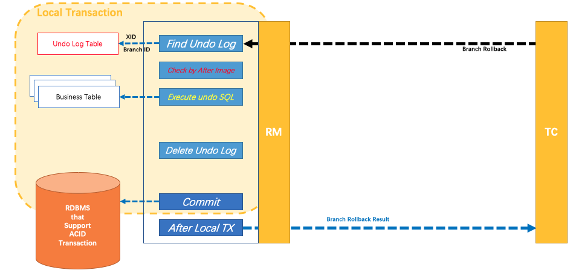

## 98.你的微服务项目出了异常怎样更快速的定位？

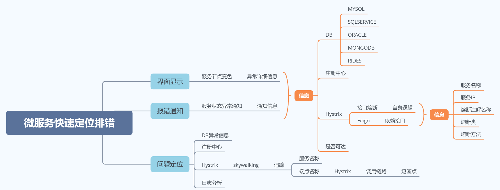

介绍

- 页面

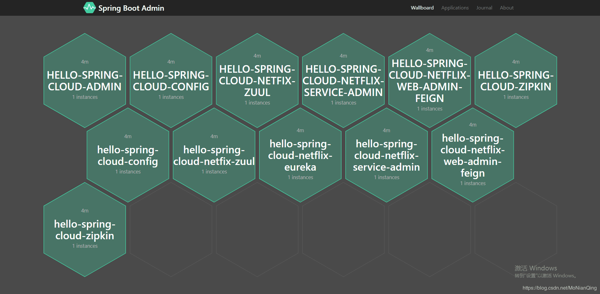

- 报错通知

- DB

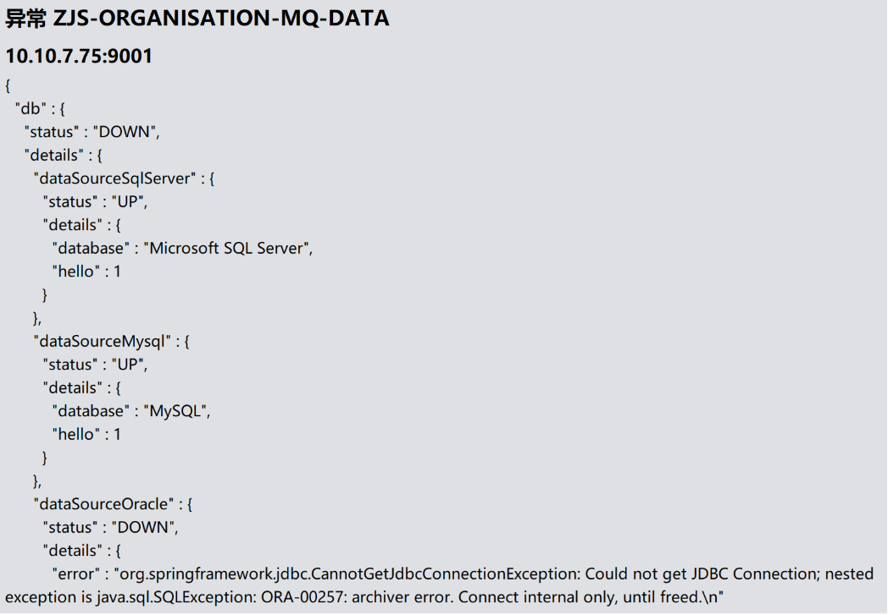

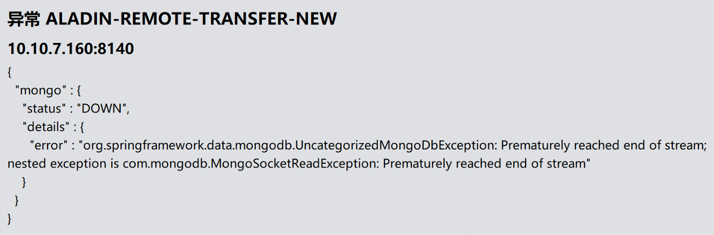

- Hystrix

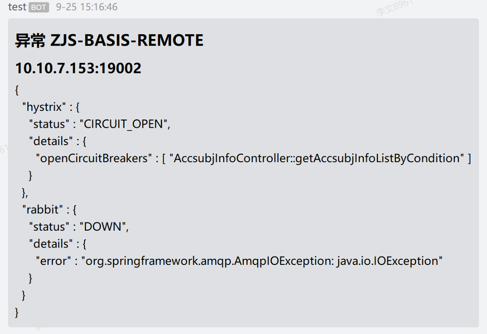

问题排查

- hystrix

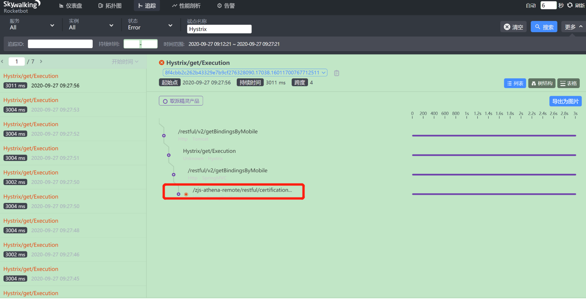

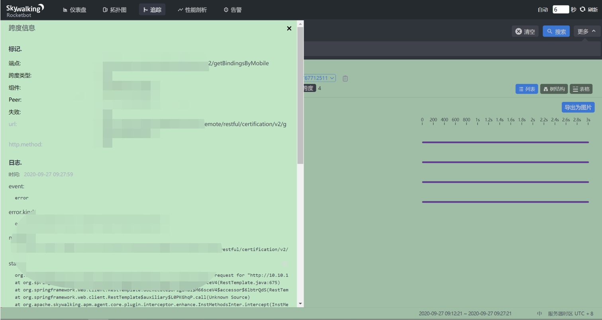

- 日志

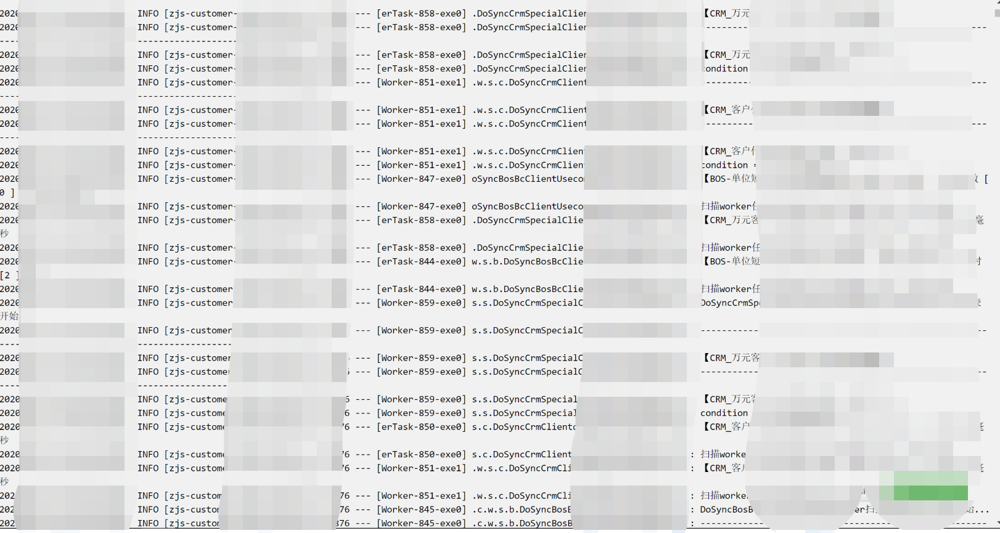

动态日志级别调整

- 使用场景

- 线上问题排查。

- 使用方式

- 直接调整单个运行的节点的日志级别获取更详细的日志信息。

- 使用效果

- 无需重启服务即可打印详细日志。

- 单节点调整，不会影响其他节点。

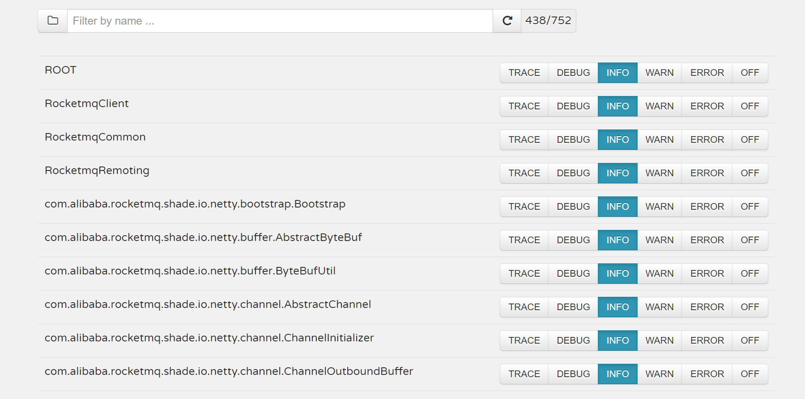

历史状态日志

- 查看一定时间内的微服务状态信息

- 上线下情况

- 访问情况

- 异常情况及其详细信息

- 状态变化时间点

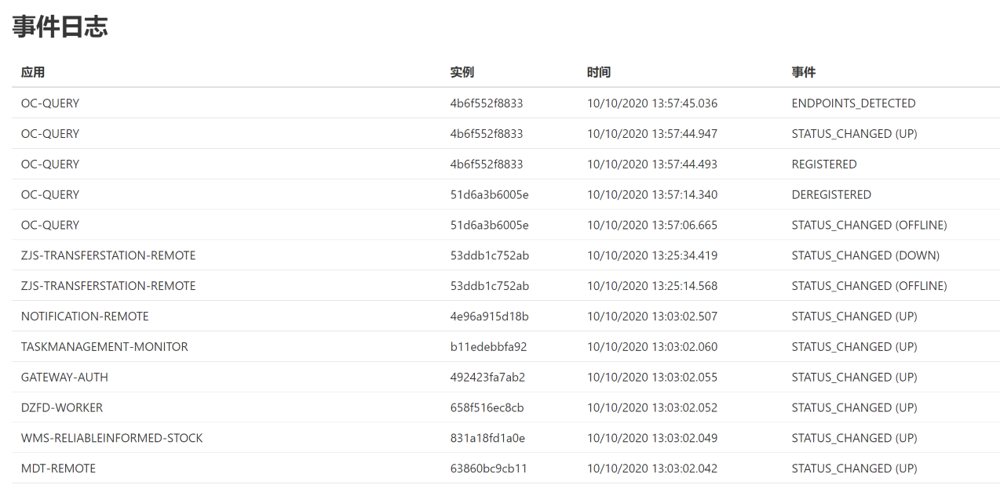

实际案例

- 微服务执行对应数据库测试语句失败。

- 监控页面微服务对应颜色从绿色变成红色。

- 触发企业微信通知

- 相关人员获知微服务出现的异常情况与原因

- 解决问题

- 可以通过异常信息直接判断异常原因

- 直接进行相关处理。

- 通过异常信息无法判断异常原因

- 直接访问该微服务的异常节点查看相关日志。

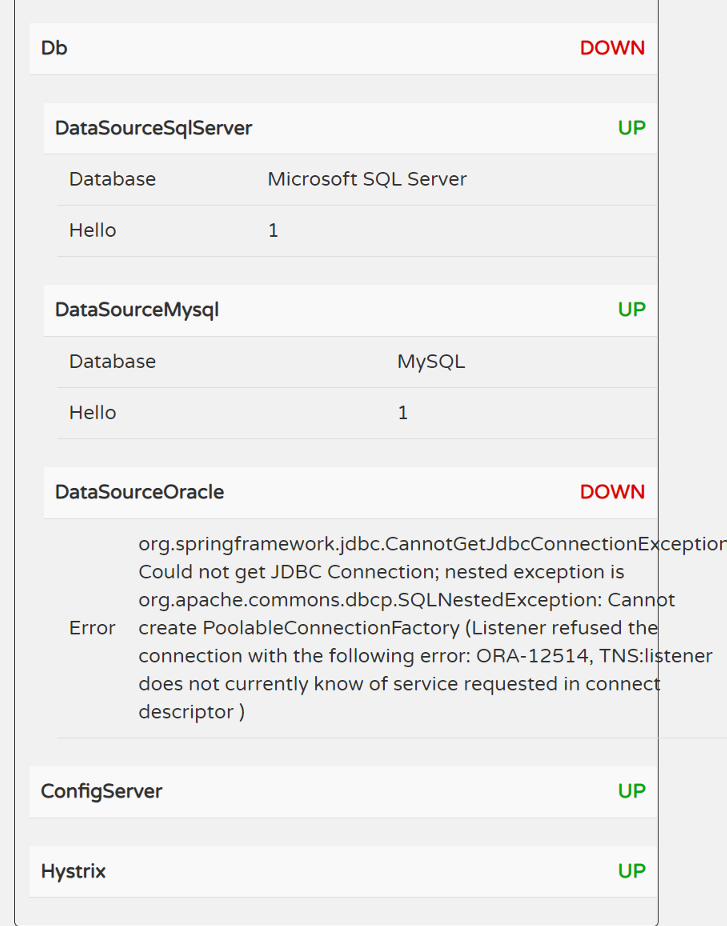

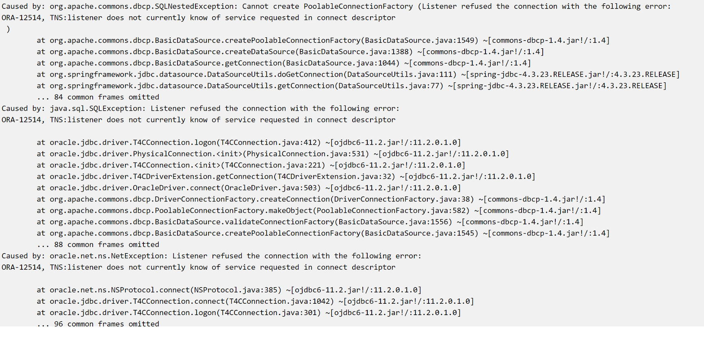

低版本问题

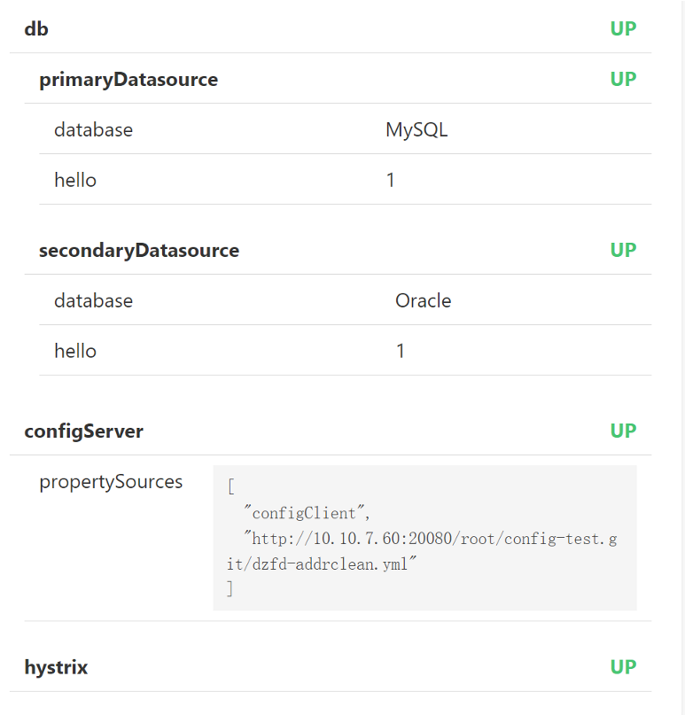

- 低版本的配置中心会每次检查都会访问一次配置中心数据

- 解决方案

- 升级为部门标准版本

- 高版本优化

- 加入缓存

## 99.Ribbon说说有哪些负载均衡策略

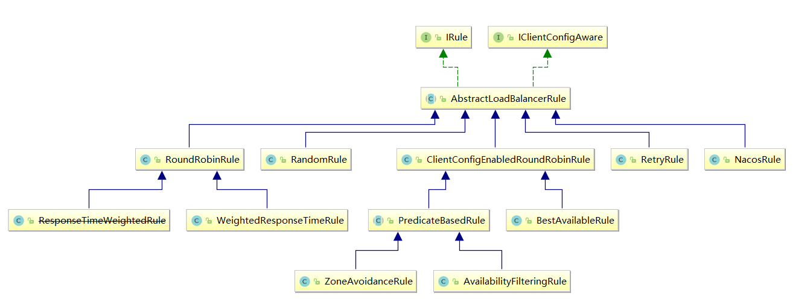

IRule

这是所有负载均衡策略的父接口，里边的核心方法就是choose方法，用来选择一个服务实例。

AbstractLoadBalancerRule

AbstractLoadBalancerRule是一个抽象类，里边主要定义了一个ILoadBalancer，这里定义它的目的主要是辅助负责均衡策略选取合适的服务端实例。

- RandomRule

看名字就知道，这种负载均衡策略就是随机选择一个服务实例，看源码我们知道，在RandomRule的无参构造方法中初始化了一个Random对象，然后在它重写的choose方法又调用了choose(ILoadBalancer lb, Object key)这个重载的choose方法，在这个重载的choose方法中，每次利用random对象生成一个不大于服务实例总数的随机数，并将该数作为下标所以获取一个服务实例。

- RoundRobinRule

RoundRobinRule这种负载均衡策略叫做线性轮询负载均衡策略。这个类的choose(ILoadBalancer lb, Object key)函数整体逻辑是这样的：开启一个计数器count，在while循环中遍历服务清单，获取清单之前先通过incrementAndGetModulo方法获取一个下标，这个下标是一个不断自增长的数先加1然后和服务清单总数取模之后获取到的（所以这个下标从来不会越界），拿着下标再去服务清单列表中取服务，每次循环计数器都会加1，如果连续10次都没有取到服务，则会报一个警告No available alive servers after 10 tries from load balancer: XXXX。

- RetryRule（在轮询的基础上进行重试）

看名字就知道这种负载均衡策略带有重试功能。首先RetryRule中又定义了一个subRule，它的实现类是RoundRobinRule，然后在RetryRule的choose(ILoadBalancer lb, Object key)方法中，每次还是采用RoundRobinRule中的choose规则来选择一个服务实例，如果选到的实例正常就返回，如果选择的服务实例为null或者已经失效，则在失效时间deadline之前不断的进行重试（重试时获取服务的策略还是RoundRobinRule中定义的策略），如果超过了deadline还是没取到则会返回一个null。

- WeightedResponseTimeRule（权重 —nacos的NacosRule ，Nacos还扩展了一个自己的基于配置的权重扩展）

WeightedResponseTimeRule是RoundRobinRule的一个子类，在WeightedResponseTimeRule中对RoundRobinRule的功能进行了扩展，WeightedResponseTimeRule中会根据每一个实例的运行情况来给计算出该实例的一个权重，然后在挑选实例的时候则根据权重进行挑选，这样能够实现更优的实例调用。WeightedResponseTimeRule中有一个名叫DynamicServerWeightTask的定时任务，默认情况下每隔30秒会计算一次各个服务实例的权重，权重的计算规则也很简单，如果一个服务的平均响应时间越短则权重越大，那么该服务实例被选中执行任务的概率也就越大。

- ClientConfigEnabledRoundRobinRule

ClientConfigEnabledRoundRobinRule选择策略的实现很简单，内部定义了RoundRobinRule，choose方法还是采用了RoundRobinRule的choose方法，所以它的选择策略和RoundRobinRule的选择策略一致，不赘述。

- BestAvailableRule

BestAvailableRule继承自ClientConfigEnabledRoundRobinRule，它在ClientConfigEnabledRoundRobinRule的基础上主要增加了根据loadBalancerStats中保存的服务实例的状态信息来过滤掉失效的服务实例的功能，然后顺便找出并发请求最小的服务实例来使用。然而loadBalancerStats有可能为null，如果loadBalancerStats为null，则BestAvailableRule将采用它的父类即ClientConfigEnabledRoundRobinRule的服务选取策略（线性轮询）。

- ZoneAvoidanceRule （默认规则，复合判断server所在区域的性能和server的可用性选择服务器。）

ZoneAvoidanceRule是PredicateBasedRule的一个实现类，只不过这里多一个过滤条件，ZoneAvoidanceRule中的过滤条件是以ZoneAvoidancePredicate为主过滤条件和以

AvailabilityPredicate为次过滤条件组成的一个叫做CompositePredicate的组合过滤条件，过滤成功之后，继续采用线性轮询(RoundRobinRule)的方式从过滤结果中选择一个出来。

- AvailabilityFilteringRule（先过滤掉故障实例，再选择并发较小的实例）

过滤掉一直连接失败的被标记为circuit tripped的后端Server，并过滤掉那些高并发的后端Server或者使用一个AvailabilityPredicate来包含过滤server的逻辑，其实就是检查status里记录的各个Server的运行状态。

## 100.你项目哪些场景用到了限流、降级？怎么配的？

服务降级的预案

在进行降级之前要对系统进行梳理，提前将一些 不重要 或 不紧急 的服务（弱依赖）或任务进行服务的 延迟使用 或 暂停使用。 （积分）

看看哪些服务是必须誓死保护，哪些系统是能够丢卒保帅；具体可以参考日志级别设置预案：

一般：有些服务偶尔因为网络抖动或者服务正在上线而超时，可以自动降级；

警告：有些服务在一段时间内成功率有波动（如在95~100%之间），可以自动降级或人工降级，并发送告警；

错误：可用率低于90%，或者连接池被占用满了，或者访问量突然猛增到系统能承受的最大阀值，此时可以根据情况自动降级或者人工降级；

严重错误：因为特殊原因数据错误了，此时需要紧急人工降级

测试会提供准确的数据；

自己算： 二八法则

计算关系：

QPS = 并发量 / 平均响应时间

并发量 = QPS * 平均响应时间

根据以上计算关系，我们来预估下单日访问量在 1000W 需要多大的QPS来支持：

通常情况下，80% 的访问量集中在 20%的时间，算一下这 1000w pv实际需要机器达到多少qps才能满足，

qps = (1000w * 0.8) / (24 * 3600 * 0.2)

qps = 462.9

根据压力测试的反馈，单台机子的QPS是多少，利用以上结果就可以算出需要几台机器 或 大致推算出需不需要使用缓存配置

方案一： 使用集群服务器 不使用缓存服务器

方案二： 使用集群服务器 同时使用缓存服务器 (推荐)

例子：

每秒可以处理的请求数 QPS（TPS）：每秒钟可以处理的请求或者事务的数量。

并发数： 系统同一时候处理的请求数量（事务数）

响应时间： 一般取平均响应时间

QPS（TPS）= 并发数/平均响应时间

并发数 = QPS*平均响应时间

例子:

一个典型的上班签到系统，早上8点上班。7点半到8点这30分钟的时间里用户会登录签到系统进行签到。公司员工为1000人，平均每一个员上登录签到系统的时长为5分钟。能够用以下的方法计算。

（1）QPS = 1000/(30*60) 事务/秒

（2）平均响应时间为 = 5*60 秒

（3）并发数= QPS*平均响应时间 = 1000/(30*60) *(5*60)=166.7

再看如果老板要求实现多少并发数，在反推出机器需要多少QPS，看是否集群配置。

[上一章](09-spring-boot.md) · [返回首页](../README.md)
